## 🛠️ Procedimento Executado

1) Criação de um grupo de segurança estatico com nome *gp_cenpc_entra-id_auth_external_invite*.

   * Entra ID > Manage > Group > New.
   
     *  Selecionado a opção de grupo *estatico*.
     *  Habilitada a opção *Microsoft Entra roles can be assigned to the group*.
     *  Em ROLES selecionado *Guest Inviter*.
     *  Nenhum usuário foi incluido no grupo neste momento.
         
     ### Observação:

        - Não é possivel criar um grupo de *associação dinâmica* habilitando a opção *Microsoft Entra roles can be assigned to the group*.

        - Não é possivel aninhar grupos de *associação dinâmica* com *Microsoft Entra roles can be assigned to the group*.

               
2) Para incluir os usuários no grupo criado, foram realizados os procedimentos:

   * Entra ID > Users > All Users > Add filter > *Job Title* > Operator *==* > Value *Analista Senior*.
   
     **"O mesmo procedimento foi realizado para os usuários com *Job Title = Gerente*."**

   Após os resultados serem exibidos:
    
   *  Selecionado todos os usuários > Download users > Start bulk operation.
   *  Após concluir clique nas *notificações* e no link *sucesso*.
   *  Localize o arquivo com os dados que foram exportados e clique no *link* para realizar o download do arquivo *.csv*.
   *  Salve os arquivos.
    
3) Editando o grupo que foi criado *gp_cenpc_entra-id_auth_external_invite*.

   * Entra ID > Manager > Groups > All Groups > *clicando no link do grupo* "gp_cenpc_entra-id_auth_external_invite".
   * Em Members > Bulk operations > Import Member.
   * Download do template do arquivo *.csv* para editar.
   * Editando os arquivos *.csv*
   * Salvando o arquivo *.csv* que foi editado.
            
4) Importando o arquivo *.csv* que foi editado para o grupo *gp_cenpc_entra-id_auth_external_invite*.

   * Entra ID > Manager > Groups > All Groups > *clicando no link do grupo* "gp_cenpc_entra-id_auth_external_invite".
   * Em Members > Bulk operations > Import Member > Upload your csv file.
   * Usuários importados com sucesso.
      
5) Conferindo em All groups > "gp_cenpc_entra-id_auth_external_invite" > Manage > Assigned roles, se as atribuição *Guest Inviter* estava associada.
  
### 1. Validação do ambiente

- Usuários do ambiente que não estão no grupo "gp_cenpc_entra-id_auth_external_invite" não conseguem enviar convites para colaboradores externos.  

### 2. Validação dos usuários

- Realizados testes com os usuários *maria.santos@cenpc.shop - Gerente* e *joao.pedro@cenpc.shop - Assistente*. 

### 3. Configuração da permissão

- maria.santos@cenpc.shop : Incluida no grupo gp_cenpc_entra-id_auth_external_invite.

- joao.pedro@cenpc.shop : Não foi incluido no grupo.

### 4. Validação pós-configuração

- maria.santos@cenpc.shop : Enviou o convite para o e-mail *philipbanks.b2c@gmail.com* com sucesso.

- joao.pedro@cenpc.shop : Não conseguiu enviar o convite para o e-mail *philipbanks.b2c@gmail.com*. 

## 💻 Comandos / Scripts Utilizados

- null.

## 📸 Evidências

As evidências do atendimento devem ser armazenadas na pasta:

```text
img/
├── 01.gp_cenpc_entra-id_auth_external_invite.png
├── 02.gp_cenpc_entra-id_auth_external_invite.png
├── 03.users_consulta.png
├── 04.users_download.png
├── 05.users_csv.png
├── 06.users_upload_csv.png
├── 07.users_group_upload.png
├── 08.assigned_users.png
├── 09.permissao.png
├── 10.invite_fail.png
└── 11.invite_success.png
```

### Evidência 01 — Criação do grupo *gp_cenpc_entra-id_auth_external_invite*.

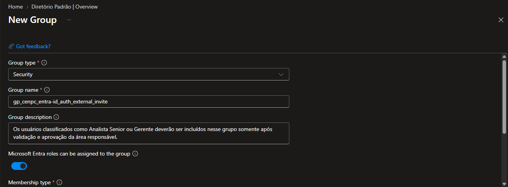

### Evidência 02 — Propriedades do grupo *gp_cenpc_entra-id_auth_external_invite*.

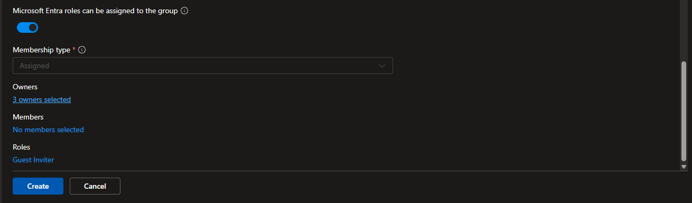

### Evidência 03 — Consulta dos usuários.

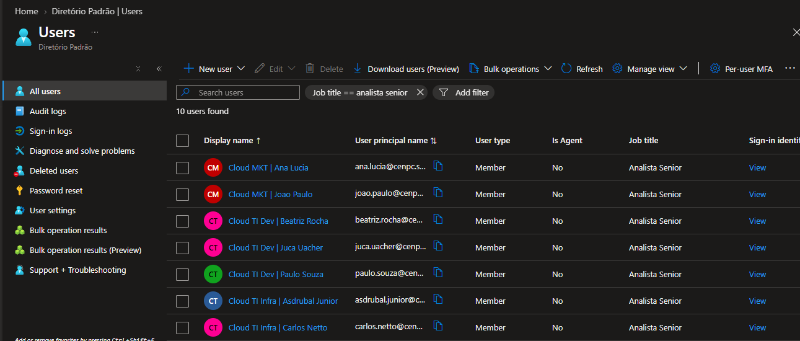

### Evidência 04 — Download da planilha com a consulta dos usuários.

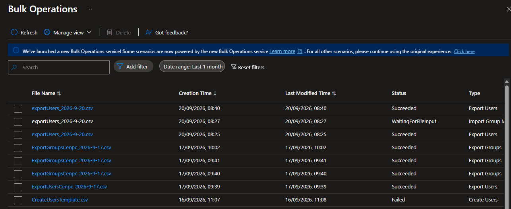

### Evidência 05 — Editando o arquivo .CSV.

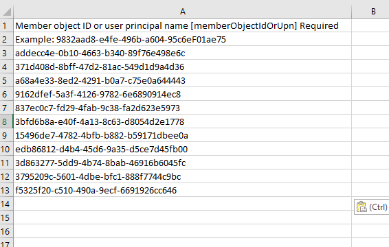

### Evidência 06 — Upload da planilha.

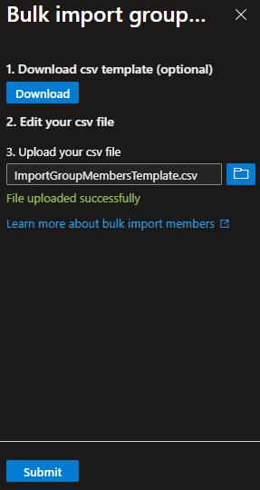

### Evidência 07 — Upload da planilha.

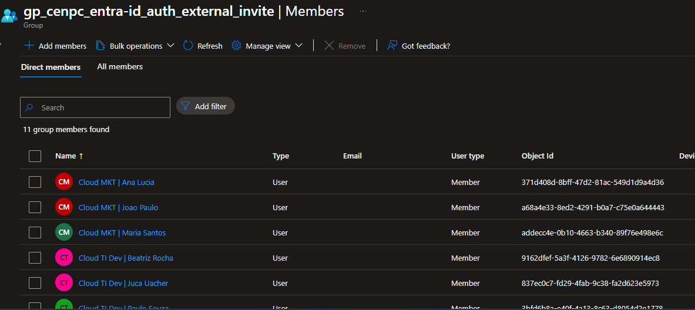

### Evidência 08 — Consulta Roles Assigned.

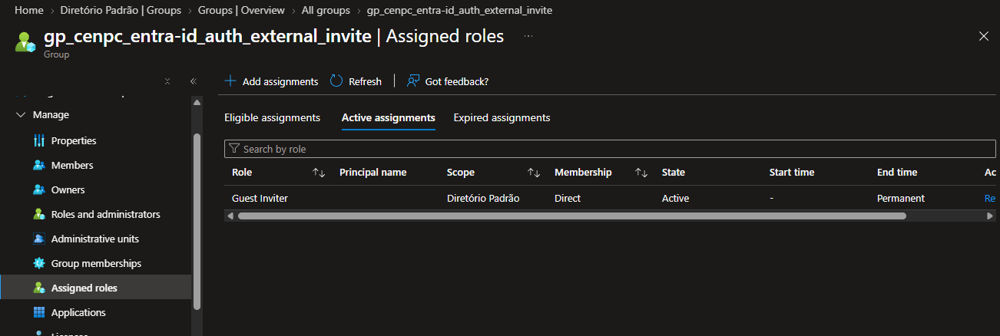

### Evidência 09 — Permissões.

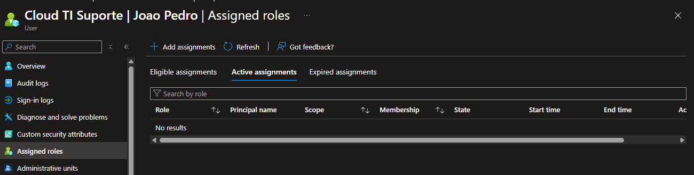

### Evidência 10 — Falha no envio.

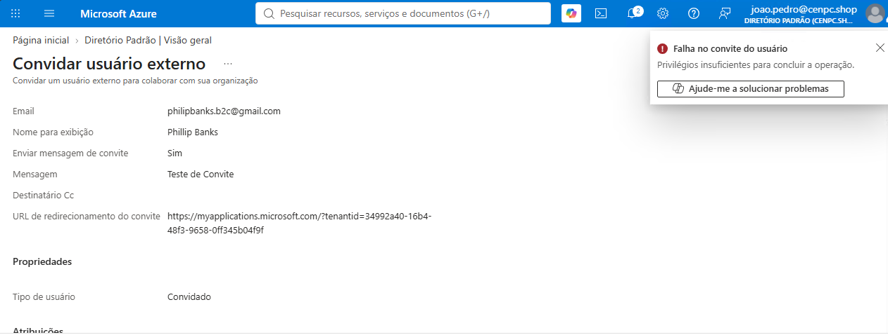

### Evidência 11 — Sucesso no envio.

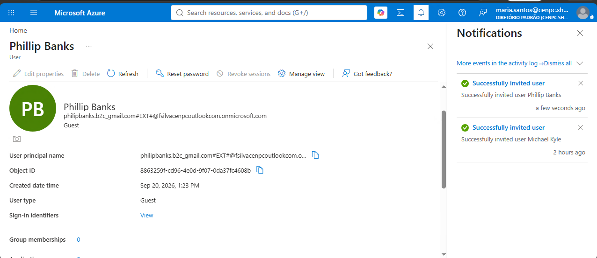

---

## ✅ Resultado

**Chamado resolvido com sucesso.**

A solicitação foi atendida conforme os requisitos definidos pelo solicitante. As permissões foram aplicadas no escopo adequado e posteriormente validadas.

---

## 🔐 Segurança / Boas Práticas

Durante o atendimento foram considerados:

* Princípio do menor privilégio;
* Aplicação da permissão no menor escopo necessário;
* Validação da identidade dos usuários;
* Utilização de grupos para gerenciamento de permissões, quando aplicável;
* Validação pós-implementação;
* Registro das evidências do atendimento.

---

## 📊 Impacto

**Impacto:** [✅ Baixo / Médio / Alto]

**Serviços afetados:** [null]

**Usuários afetados:** [11]

**Indisponibilidade:** [✅ Não houve / X 0]

---

## ⏱️ Tempo de Atendimento

| Etapa        |      Tempo |
| ------------ | ---------: |
| Análise      |     10 min |
| Execução     |     15 min |
| Validação    |     10 min |
| Documentação |     15 min |
| **Total**    | **50 min** |

---

## 🏁 Encerramento

**Status:** ✅ Resolvido

**Motivo do encerramento:** Solicitação atendida e validada com sucesso.

**Próxima ação:** Nenhuma ação pendente.
