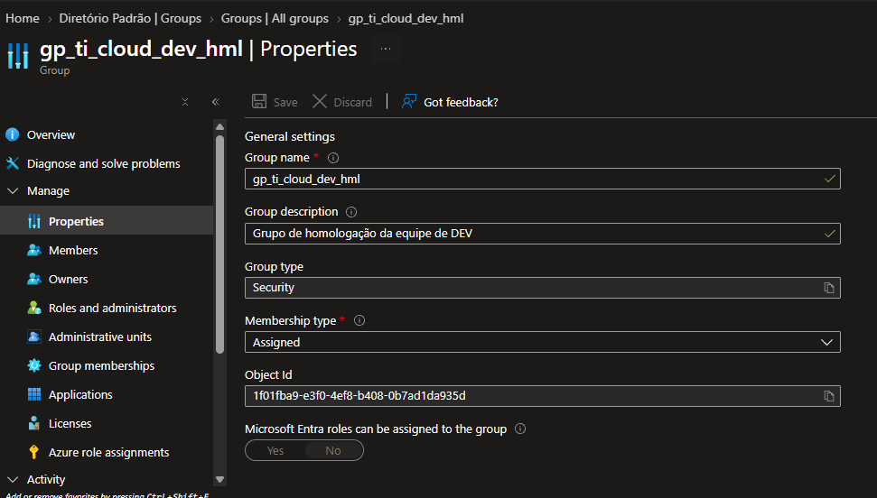
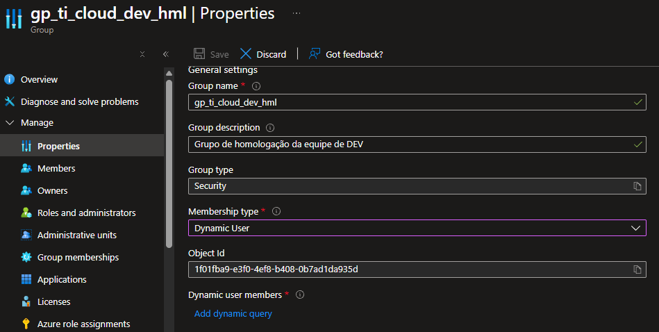
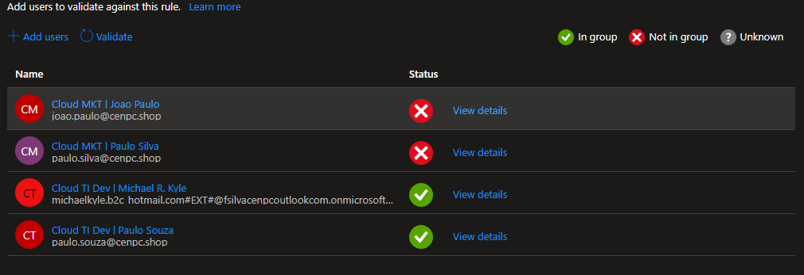
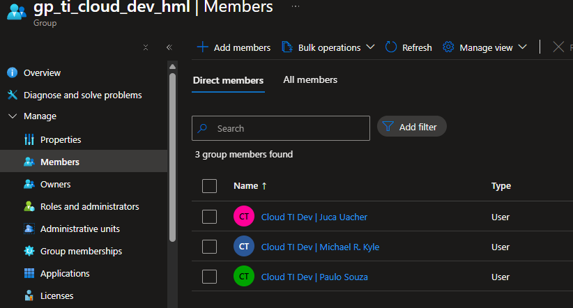

## Migração de Associação Estática (Assigned) para Associação Dinâmica (Dynamic User).

### 1. Objetivo.

Facilitar a forma de incluir usuários nos grupos em seus respectivos setores ou funções.

***
### 2. Cenário.

A equipe de TI Development tem um grupo chamado "gp_ti_cloud_dev_hml" onde a associação do grupo é feita de forma manual (Assigned).

Para otimizar e corrigir falhas no momento de incluir usuários no grupo, foi solicitada a alteração para associar o grupo para forma dinâmica (Dynamic User).

***
### 3. Pré-requisitos.

* Ter no minimo função de "Administrador de Grupos".
* Tenant tem que possuir licença Entra ID P1 ou P2 ou Intune for Education.
  
***
### 4. Configuração Atual.

* O grupo "gp_ti_cloud_dev_hml" está com Associação Estática (Assigned).

  
  
***  
### 5. Alteração do Tipo de Associação.

* Entra ID > Groups > All Groups.
  
* Após selecionar o grupo "gp_ti_cloud_dev_hml" > Properties.
  
* Alterado o tipo de associação de Estática (Assigned) para Dinâmica (Dynamic User), onde foi disponibilizado o link "Dynamic user members > Add dynamic query".

  

***
### 6. Definição da Regra Dinâmica.

* Clicando no link "Add dynamic query" foi criada regra -- (user.department -eq "TI | Development"). 

### 7. Validação.

* A regra criada foi validada utilizando a opção "Validate Rules", onde é mostrado os usuários que farão parte do grupo.

  

***
### 8. Impactos e Considerações.

Os próximos usuários que forem criados para equipe de TI Development serão adicionados no grupo automaticamente.

***
### 9. Resultado.

* Os usuários da equipe de Ti Development são adicionados ou removidos automaticamente após as alterações.

   

***
### 11. Atualização do Procedimento.

* 15 de setembro 2026

***
