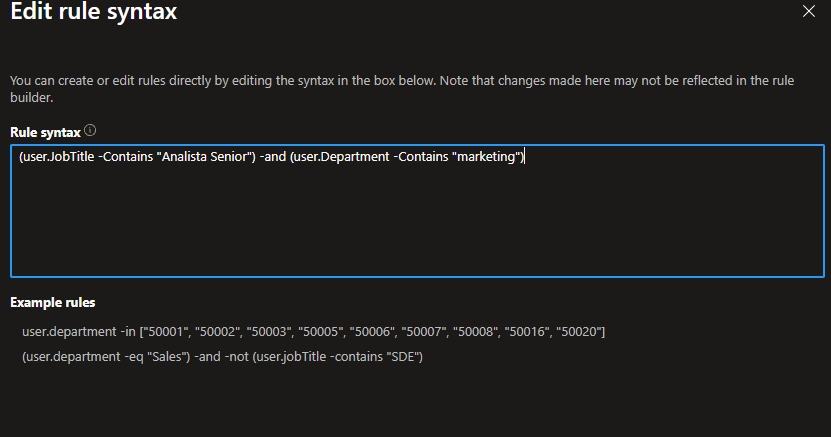
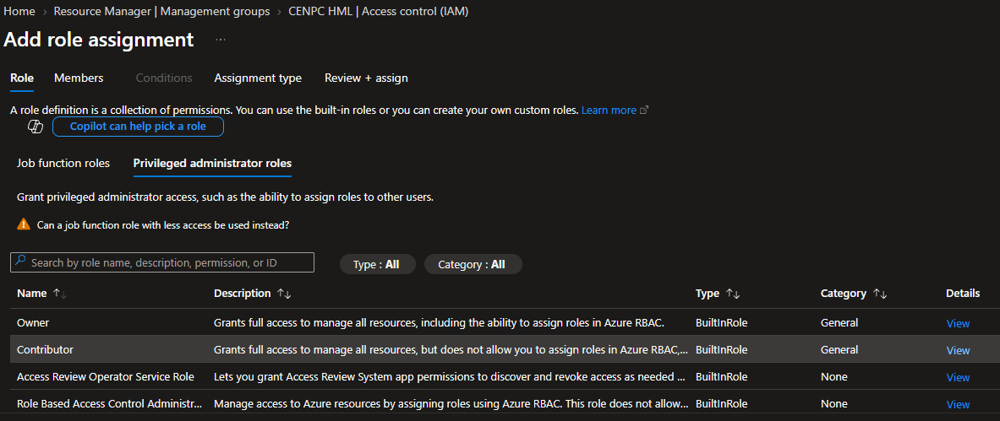
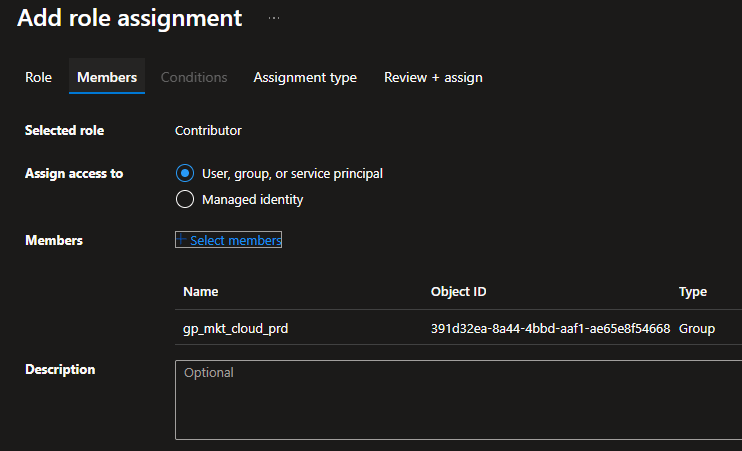
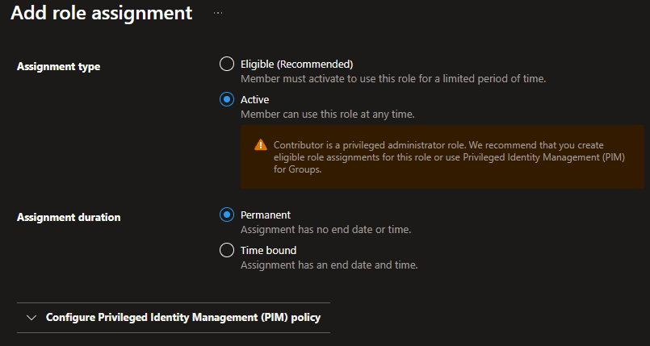
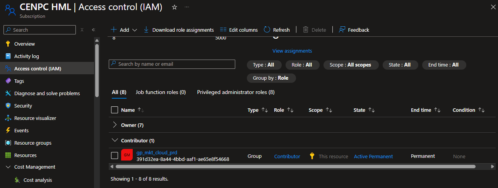
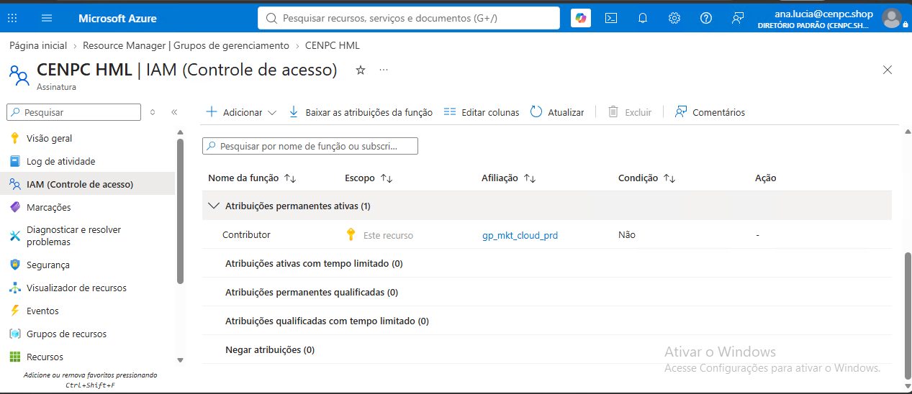
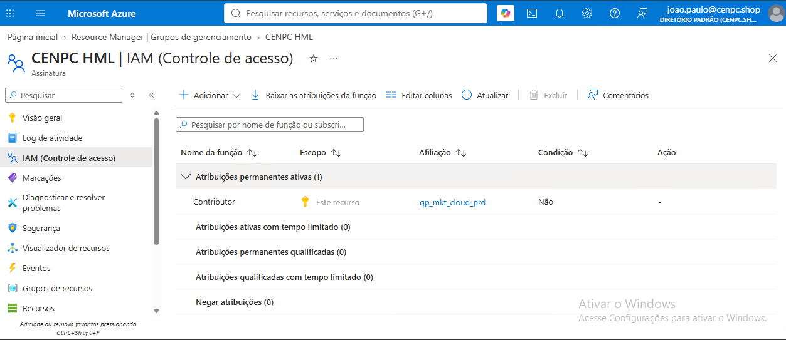

## 1. Implementação

Após as aprovações necessárias, a equipe de Cloud deverá realizar a atribuição da role:

1) Foi criado um grupo de segurança "gp_mkt_cloud_prd" e incluído os usuários através de associação dinâmica.

* Evidência da configuração:

  

2) Subscription HML >> Access Control (IAM) >> Add role assignment**

* Role: ** Contributor

* ** Evidência da configuração:
  

* Scope: ** Subscription

* ** Evidência da configuração:

  

  

*  Members: ** Usuários MKT Sênior aprovados
* ** Evidência da configuração:

  

---

## 2. Validação

Após a implementação, deverá ser realizada a validação do acesso:

1) Confirmar a atribuição da role Contributor;

2) Validar o escopo da permissão;

3) Solicitar ao usuário teste de acesso ao ambiente HML;

* Evidência da configuração:

  

  

4. Confirmar que os recursos necessários podem ser administrados;
5. Registrar evidências da alteração no chamado.

---

## 3. Resultado esperado

Os usuários de nível Sênior da equipe de MKT deverão possuir acesso **Contributor exclusivamente na Subscription CENPC HML**, permitindo a administração dos recursos necessários para suas atividades de homologação, sem alteração das permissões existentes no ambiente de Produção.

---

## 4. Evidências

* Evidência 01:** Aprovação da gestão de MKT
* Evidência 02:** Tela de atribuição RBAC
* Evidência 03:** Validação do acesso pelo usuário

---

## 5. Encerramento

* Status: ** ☐ Em análise ☐ Em implementação ☐ Aguardando validação ☑ Concluído

* Analista responsável: ** Fabio Silva Cloud Engineer / Azure Administrator

* Data de implementação: ** 12/09/2026

**Observação de encerramento:**
Permissão Contributor atribuída aos usuários aprovados no escopo da Subscription CENPC HML.
