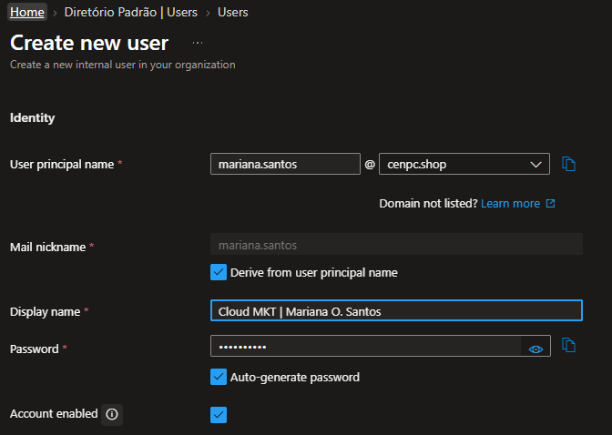
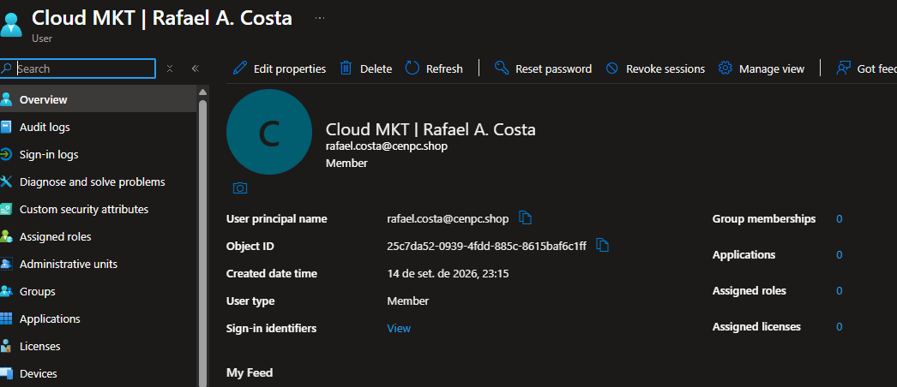
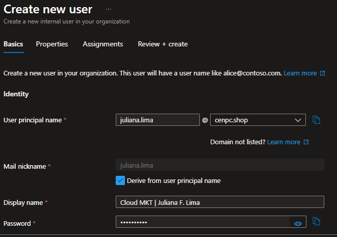
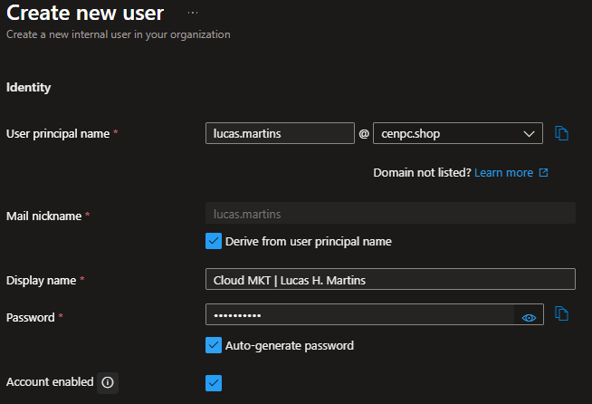
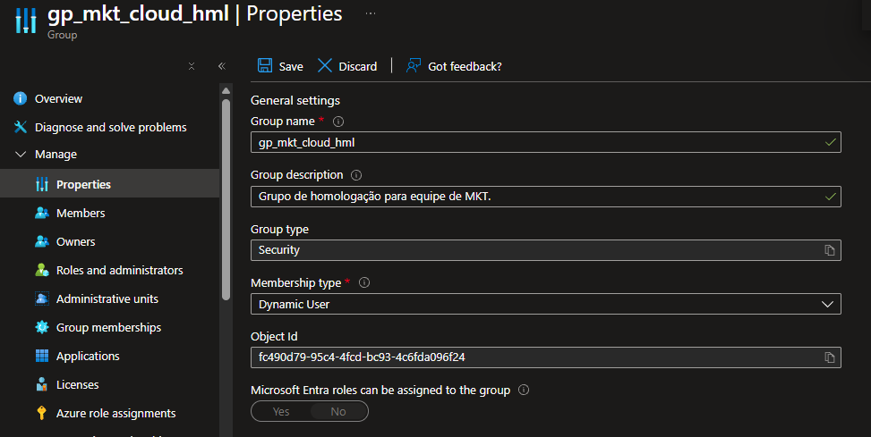
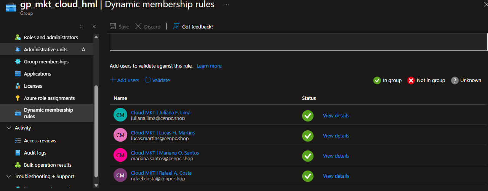

## 1. Descrição da Resolução.

* Entra ID > All User > Create New User.

  Usuário: Mariana Oliveira Santos.
  
   * Nome completo: Mariana Oliveira Santos;
   * Display Name: Cloud MKT | Mariana O. Santos;
   * User Principal Name (UPN): mariana.santos@cenpc.shop;
   * Departamento: Marketing;
   * Cargo (Job Title): Analista Junior;
   * Localidade: Brazil;
   * Gestor responsável: maria.santos@cenpc.shop

  Usuário: Rafael Almeida Costa.
  
   * Nome completo: Rafael Almeida Costa;
   * Display Name: Cloud MKT | Rafael A. Costa;
   * User Principal Name (UPN): rafael.costa@cenpc.shop;
   * Departamento: Marketing;
   * Cargo (Job Title): Analista Pleno;
   * Localidade;
   * Gestor responsável: maria.santos@cenpc.shop.

  Usuário: Juliana Ferreira Lima.  

   * Nome completo: Juliana Ferreira Lima;
   * Display Name: Cloud MKT | Juliana F. Lima;
   * User Principal Name (UPN: juliana.lima@cenpc.shop;
   * Departamento: Marketing;
   * Cargo (Job Title): Coordenadora;
   * Localidade: Brazil;
   * Gestor responsável: maria.santos@cenpc.shop.

  Usuário: Lucas Henrique Martins.  

   * Nome completo: Lucas Henrique Martins;
   * Display Name: Cloud MKT | Lucas H. Martins;
   * User Principal Name (UPN): lucas.martins@cenpc.shop;
   * Departamento: Marketing;
   * Cargo (Job Title): Analista Mídias Digitais
   * Localidade: Brazil;
   * Gestor responsável: maria.santos@cenpc.shop.
     
* Os usuários foram criados como Membros no Tenant.
  
* Editado o grupo "gp_mkt_cloud_hml" > Management > Properties.

  * Em Membership type > "alterado para" > Dynamic User
  
  * Query adicionada: (user.department -eq "Marketing"), para incluir os usuários que forem da equipe de "marketing".
 
  * Matriz Inicial de Alocação

| Usuário                 | Departamento | Cargo                        | Grupo sugerido     |
| ----------------------- | ------------ | ---------------------------- | ------------------ |
| Mariana Oliveira Santos | Marketing    | Analista de Marketing Júnior | `gp_mkt_cloud_hml` |
| Rafael Almeida Costa    | Marketing    | Analista de Marketing Pleno  | `gp_mkt_cloud_hml` |
| Juliana Ferreira Lima   | Marketing    | Coordenadora de Marketing    | `gp_mkt_cloud_hml` |
| Lucas Henrique Martins  | Marketing    | Analista de Mídias Digitais  | `gp_mkt_cloud_hml` |

## 4. Evidências

* Evidência 01: Usuários cadastrados conforme solicitação do RH.

  * Mariana Oliveira Santos

    

    
    

    
  * Rafael Almeida Costa
  
    

    
    

   
  * Juliana Ferreira Lima
  
    

    
    

   
  * Lucas Henrique Martins
    
    

    
    

   
* Evidência 02: Inclusão dos usuários no grupo da equipe de Marketing.

  Query
  
    

    
    

   
  Validação:
  
    

    
    

## 2. Encerramento

* Status: ☐ Em análise ☐ Em implementação ☐ Aguardando validação ☑ Concluído

* Analista responsável: Fabio Silva Cloud Engineer / Azure Administrator

* Data de implementação: 14/09/2026

/****
