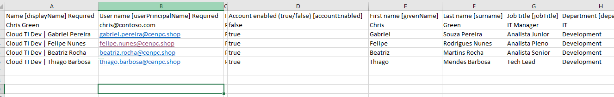
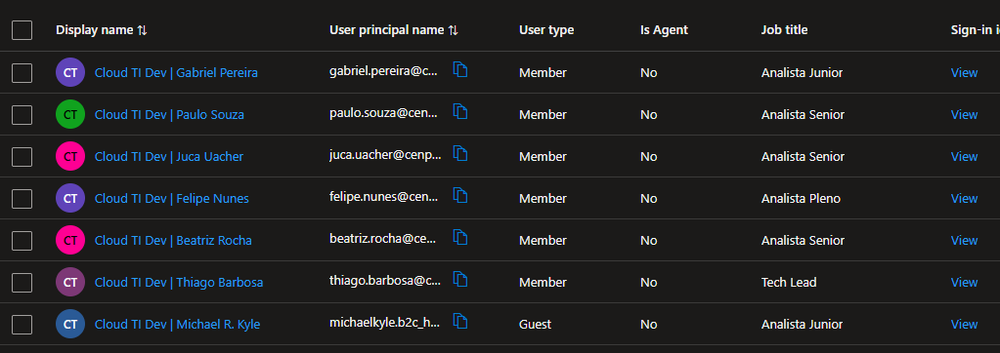
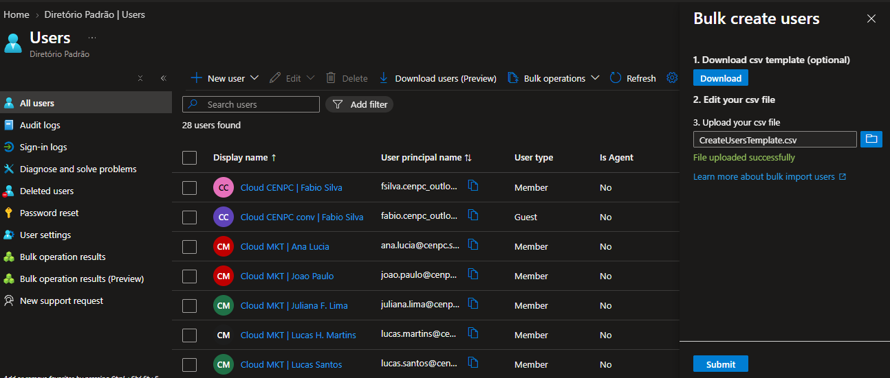

## 🎯 Objetivo

Criação das contas dos usuários para equipe de Development.

O procedimento de cadastro das contas dos usuários será feita através do "Bulk Create".

---

## 🔎 Análise / Diagnóstico

* Não necessário.

---

## 🛠️ Procedimento Executado

1. Validação do ambiente

* Entra ID > Management > User > Bulk operator > Bulk Creator.
  
* Download do arquivo CSV template.

* Preenchimento das informações dos usuários.

* Upload do arquivo CSV template.

* Usuários cadastrados com sucesso.

***

2. Validação pós-configuração

Após a aplicação da permissão, foram realizadas as seguintes validações:

* Usuários identificados corretamente;

---

## 📸 Evidências

As evidências do atendimento devem ser armazenadas na pasta:

img/

├── 01-CreateUsersTemplate.png

├── 02-upload-csv.png

└── 03-usuarios.png

### Evidência 01 

### Evidência 02

### Evidência 03

---

## ✅ Resultado

**Chamado resolvido com sucesso.**

A solicitação foi atendida conforme os requisitos definidos pelo solicitante.

As permissões foram aplicadas no escopo adequado e posteriormente validadas.

---

## 🏁 Encerramento

**Status:** ✅ Resolvido

**Motivo do encerramento:** Solicitação atendida e validada com sucesso.

**Próxima ação:** Nenhuma ação pendente.

