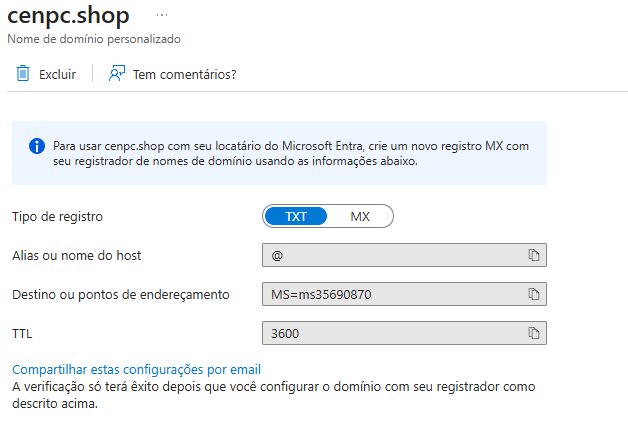
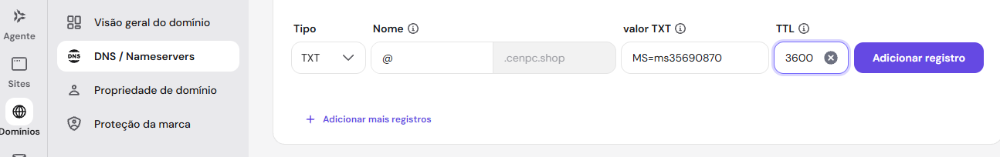
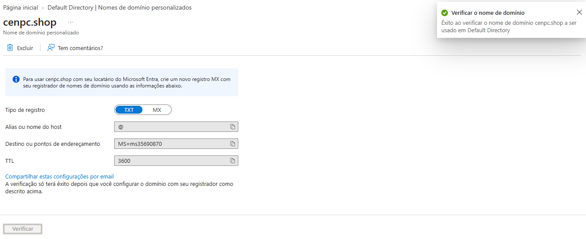
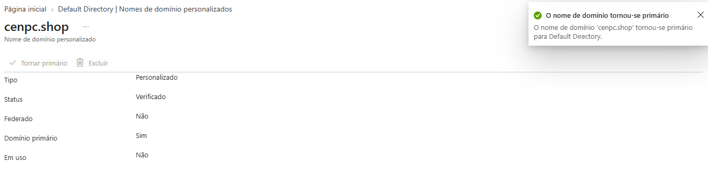
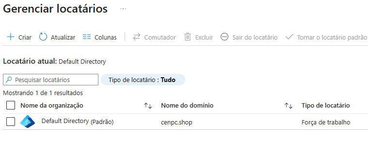

# Alteração e Configuração

* Número do chamado: REQ-2026-1003-001
* Categoria: Identidade e Acessos | Dominios personalizados
* Prioridade: Média
* Solicitante: IT Infra
* Equipe responsável: IT Infra Cloud
* Status: ☐ Em análise | ☑  Em implementação | ☐ Aguardando validação | ☐ Concluído

# 1. Descrição.

* A equipe de IT Infra Cloud solicita a alteração do dominio primario do ambiente.

    * Atual (padrão) : *fnsilvacenpcoutlookcom.onmicrosoft.com*
    
    * Novo: *cenpc.shop*

# 2. Atendimento.

* **Entra ID** *> Gerenciar > Nomes de dominio personalizados > Add domínio personalizado*.

    * Inserido o domínio *cenpc.shop*.

    * Configurações do registro de domínio para inserir no provedor de DNS.
    
       
    
    * No provedor de domínio > **Dominios > DNS >** selecione o dominio cadastrado.

        * *Dns/Nameservers > Gerenciar registros DNS* foram inseridas as informações fornecidas pelo Azure.

            

        * Registro adicionado com sucesso.

    * No Azure, a plataforma reconheceu o domínio que foi cadastrado.

        

    * O domínio foi habilitado para ser o principal do Tenant.

        
    
# 3. Encerramento

* O domínio foi alterado com sucesso.

    

* O chamado foi encerrado.

* Status: ☐ Em análise | ☐ Em implementação | ☐ Aguardando validação | ☑ Concluído

* Analista responsável: Fabio Silva

#