# 🎫 CHAMADO DE CRIANDO GRUPOS DINAMICOS

* Número do chamado: REQ-2026-1005-001
* Categoria: TI | Grupos | Entra ID
* Prioridade: Média
* Solicitante: TI
* Equipe responsável: Suporte Técnico
* Status: ☑ Em análise | ☐ Em implementação | ☐ Aguardando validação | ☐ Concluído

# 1. 📌 Descrição.

* Solicito que crie os seguites grupos para as equipes instituição.

    * Equipe de Marketing : All | Junior | Pleno | Senior | Gerente.

    * Equipe de Development : All | Junior | Pleno | Senior | Gerente.

    * Equipe de IT Infra : All | Junior | Pleno | Senior | Gerente.

    * Equipe de IT Support : All | Junior | Pleno | Senior | Gerente.

    * Colaboradores :  All | Junior | Pleno | Senior | Gerente.

# 2. 📝 Atendimento

```` 
Para esse chamado:

* O Entra ID tem que estar com as licenças P1, P2 ou Intune for Education ativadas.

* Os grupos serão criados usando associação dinâmica (Dynamic User).

* Taxonomia para nomes: gp_"Ambiente"_"Setor"_"Departamento"_"Cargo".
````    

* Entra ID > Gerenciar | Manager > Grupos | Groups > Todos os grupos | All Groups > Novo | New.

    ## Equipe de MKT Junior:
    
    * **Tipo** : Segurança.
    
    * **Nome** : gp_cloud_mkt_analyst_junior
        
    * **Descrição** : Colaboradores que fazem parte da equipe de MKT nivel "Junior".
        
    * **Regra Dinâmica** : Colaboradores cujo departamento seja igual "marketing" e cargo seja igual "Analista MKT Junior".

    ## Equipe de MKT Pleno:
    
    * **Tipo** : Segurança.
    
    * **Nome** : gp_cloud_mkt_analyst_pleno
        
    * **Descrição** : Colaboradores que fazem parte da equipe de MKT nivel "pleno".
        
    * **Regra Dinâmica** : Colaboradores cujo departamento seja igual "marketing" e cargo seja igual "Analista MKT pleno".

    ## Equipe de MKT Senior:
    
    * **Tipo** : Segurança.
    
    * **Nome** : gp_cloud_mkt_analyst_senior
        
    * **Descrição** : Colaboradores que fazem parte da equipe de MKT nivel "senior".
        
    * **Regra Dinâmica** : Colaboradores cujo departamento seja igual "marketing" e cargo seja igual "Analista MKT Senior".

    ## Equipe de MKT Gerente:
    
    * **Tipo** : Segurança.
    
    * **Nome** : gp_cloud_mkt_gerente
        
    * **Descrição** : Colaboradores que fazem parte da equipe de MKT nivel "Gerente".
        
    * **Regra Dinâmica** : Colaboradores cujo departamento seja igual "marketing" e cargo contenha o termo "Gerente".

    ## Equipe de MKT All:
    
    * **Tipo** : Segurança.
    
    * **Nome** : gp_cloud_mkt_all
        
    * **Descrição** : Todos os colaboradores que fazem parte da equipe de MKT.
        
    * **Regra Dinâmica** : Colaboradores cujo departamento seja igual "marketing" e cargo seja igual "Analista MKT All".        

    ## Equipe de Dev Junior:
    
    * **Tipo** : Segurança.
    
    * **Nome** : gp_cloud_dev_analyst_junior
        
    * **Descrição** : Colaboradores que fazem parte da equipe de DEV nivel "Junior".
        
    * **Regra Dinâmica** : Colaboradores cujo departamento seja igual "Deveplopment" e cargo seja igual "Analista DEV Junior".

    ## Equipe de DEV Pleno:
    
    * **Tipo** : Segurança.
    
    * **Nome** : gp_cloud_dev_analyst_pleno
        
    * **Descrição** : Colaboradores que fazem parte da equipe de DEV nivel "pleno".
        
    * **Regra Dinâmica** : Colaboradores cujo departamento seja igual "development" e cargo seja igual "Analista DEV pleno".

    ## Equipe de DEV Senior:
    
    * **Tipo** : Segurança.
    
    * **Nome** : gp_cloud_dev_analyst_senior
        
    * **Descrição** : Colaboradores que fazem parte da equipe de DEV nivel "senior".
        
    * **Regra Dinâmica** : Colaboradores cujo departamento seja igual "development" e cargo seja igual "Analista DEV Senior".

    ## Equipe de DEV Gerente:
    
    * **Tipo** : Segurança.
    
    * **Nome** : gp_cloud_dev_gerente
        
    * **Descrição** : Colaboradores que fazem parte da equipe de DEV nivel "Gerente".
        
    * **Regra Dinâmica** : Colaboradores cujo departamento seja igual "development" e cargo contenha o termo "Gerente".

    ## Equipe de DEV All:
    
    * **Tipo** : Segurança.
    
    * **Nome** : gp_cloud_dev_all
        
    * **Descrição** : Todos os colaboradores que fazem parte da equipe de Development.
        
    * **Regra Dinâmica** : Colaboradores cujo departamento seja igual "development". 

    ## Equipe de infra Junior:
    
    * **Tipo** : Segurança.
    
    * **Nome** : gp_cloud_infra_analyst_junior
        
    * **Descrição** : Colaboradores que fazem parte da equipe de infra nivel "Junior".
        
    * **Regra Dinâmica** : Colaboradores cujo departamento seja igual "IT Infraestructure" e cargo seja igual "Analista IT Infra Cloud Junior".

    ## Equipe de Infra Pleno:
    
    * **Tipo** : Segurança.
    
    * **Nome** : gp_cloud_infra_analyst_pleno
        
    * **Descrição** : Colaboradores que fazem parte da equipe de infra nivel "pleno".
        
    * **Regra Dinâmica** : Colaboradores cujo departamento seja igual "IT Infraestructure" e cargo seja igual "Analista IT Infra Cloud Pleno".

    ## Equipe de infra Senior:
    
    * **Tipo** : Segurança.
    
    * **Nome** : gp_cloud_infra_analyst_senior
        
    * **Descrição** : Colaboradores que fazem parte da equipe de infra nivel "senior".
        
    * **Regra Dinâmica** : Colaboradores cujo departamento seja igual "IT Infraestructure" e cargo seja igual "Analista IT Infra Cloud Senior".

    ## Equipe de Infra Gerente:
    
    * **Tipo** : Segurança.
    
    * **Nome** : gp_cloud_infra_gerente
        
    * **Descrição** : Colaboradores que fazem parte da equipe de Infra nivel "Gerente".
        
    * **Regra Dinâmica** : Colaboradores cujo departamento seja igual "IT Infraestructure" e cargo seja igual "Gerente".

    ## Equipe de infra All:
    
    * **Tipo** : Segurança.
    
    * **Nome** : gp_cloud_infra_all
        
    * **Descrição** : Todos colaboradores que fazem parte da equipe de infra.
        
    * **Regra Dinâmica** : Todos os colaboradores que fazem parte da equipe de Infra.        

    ## Equipe de Support Junior:
    
    * **Tipo** : Segurança.
    
    * **Nome** : gp_cloud_support_analyst_junior
        
    * **Descrição** : Colaboradores que fazem parte da equipe de Suporte técnico nivel "Junior".
        
    * **Regra Dinâmica** : Colaboradores cujo departamento seja igual "it support" e cargo seja igual "Analista Support Junior".

    ## Equipe de Support Pleno:
    
    * **Tipo** : Segurança.
    
    * **Nome** : gp_cloud_support_analyst_pleno
        
    * **Descrição** : Colaboradores que fazem parte da equipe de Support nivel "pleno".
        
    * **Regra Dinâmica** : Colaboradores cujo departamento seja igual "it support" e cargo seja igual "Analista support pleno".

    ## Equipe de Support Senior:
    
    * **Tipo** : Segurança.
    
    * **Nome** : gp_cloud_support_analyst_senior
        
    * **Descrição** : Colaboradores que fazem parte da equipe de Support nivel "senior".
        
    * **Regra Dinâmica** : Colaboradores cujo departamento seja igual "it support" e cargo seja igual "Analista Support Senior".

    ## Equipe de Support Gerente:
    
    * **Tipo** : Segurança.
    
    * **Nome** : gp_cloud_support_gerente
        
    * **Descrição** : Colaboradores que fazem parte da equipe de Support nivel "Gerente".
        
    * **Regra Dinâmica** : Colaboradores cujo departamento seja igual "it support" e cargo seja igual "Gerente".

    ## Equipe de Support All:
    
    * **Tipo** : Segurança.
    
    * **Nome** : gp_cloud_support_all
        
    * **Descrição** : Todos os colaboradores que fazem parte da equipe de Suporte.
        
    * **Regra Dinâmica** : Colaboradores cujo departamento seja igual "it support".

    ## Todos colaboradores Analistas Junior:
    
    * **Tipo** : Segurança.
    
    * **Nome** : gp_cloud_analyst_junior
        
    * **Descrição** : Todos colaboradores que tem cargo de nivel "Analista Junior".
        
    * **Regra Dinâmica** : Colaboradores cujo cargo seja contanham o termo "Junior".

    ## Todos colaboradores Analistas Pleno:
    
    * **Tipo** : Segurança.
    
    * **Nome** : gp_cloud_analyst_pleno
        
    * **Descrição** : Colaboradores que fazem parte do nivel "pleno".
        
    * **Regra Dinâmica** : Todos colaboradores cujo o cargo seja igual "Analista pleno".

    ## Todos colaboradores Analistas Senior:
    
    * **Tipo** : Segurança.
    
    * **Nome** : gp_cloud_analyst_senior
        
    * **Descrição** : Colaboradores de nivel "senior".
        
    * **Regra Dinâmica** : Todos colaboradores cujo o cargo seja igual "Analista Senior".

    ## Todos colaboradores Gerentes:
    
    * **Tipo** : Segurança.
    
    * **Nome** : gp_cloud_gerente
        
    * **Descrição** : Colaboradores de nivel "Gerente".
        
    * **Regra Dinâmica** : Todos colaboradores cujo o cargo seja igual "Gerente".


# 3. 📸 Evidências.

* **Equipe MKT**.

    * Junior :

        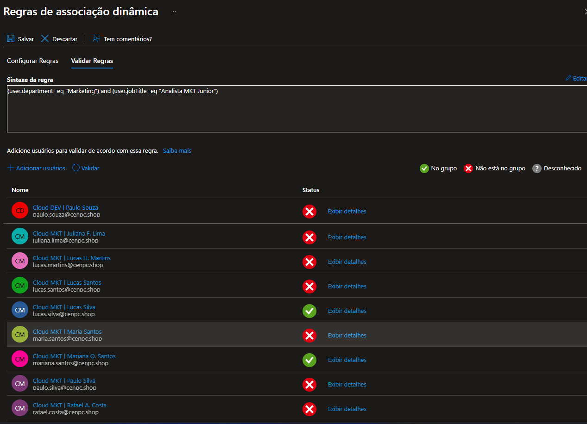
    
    * Pleno : 

        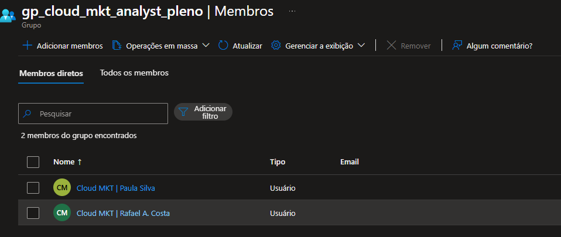
    
    * Senior : 

        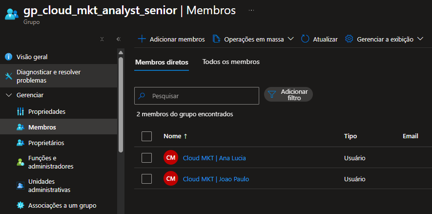

    * Gerente :

        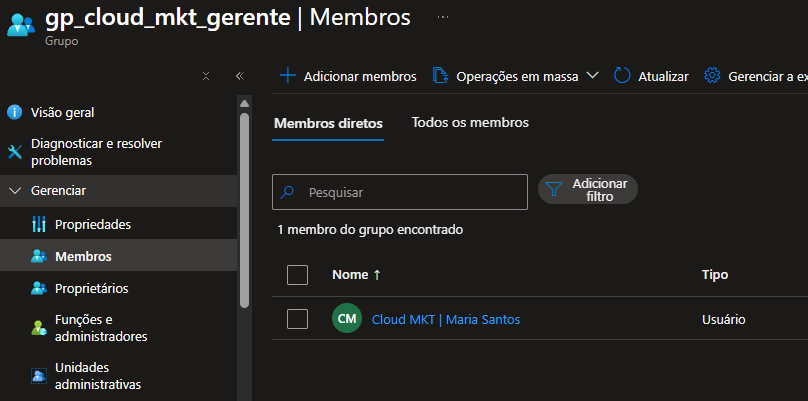
    
    * Todos : 

        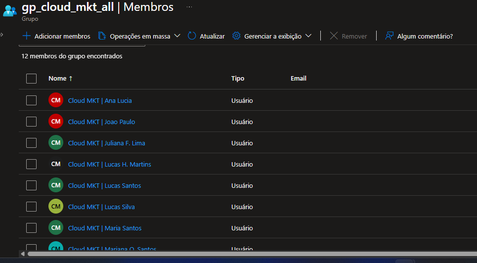

* **Equipe Dev**.

    * Junior :

        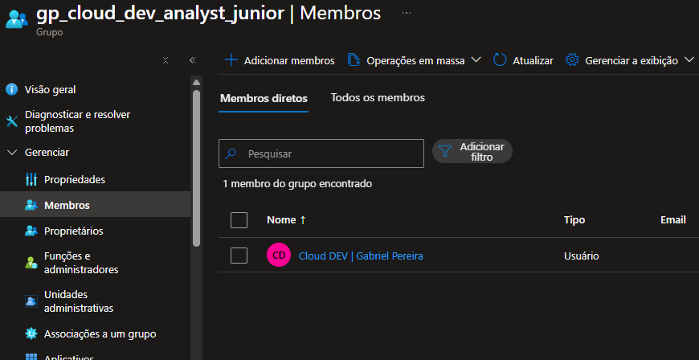

    * Pleno : 

        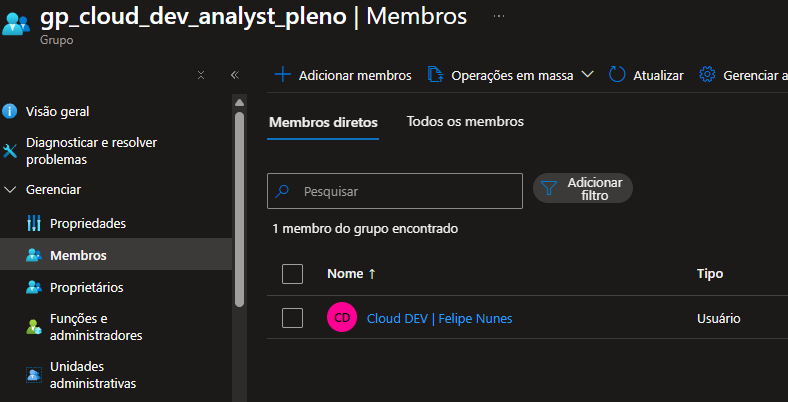

    * Senior : 

        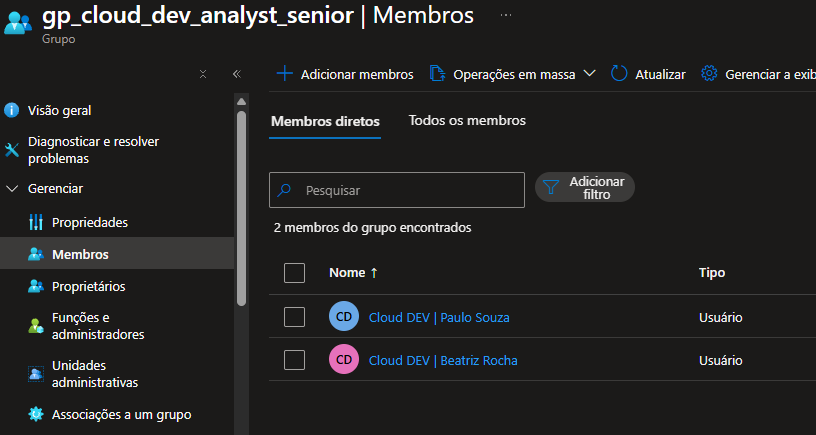

    * Gerente : 

        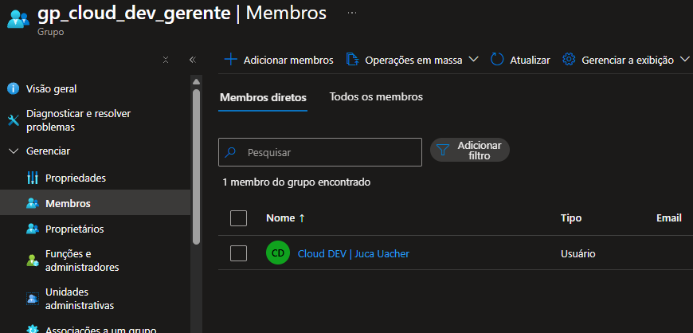

    * Todos :  

        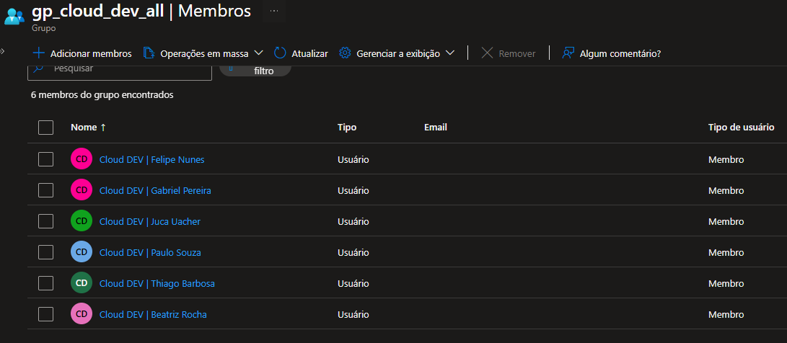

* **Equipe Infra**.

    * Junior :

        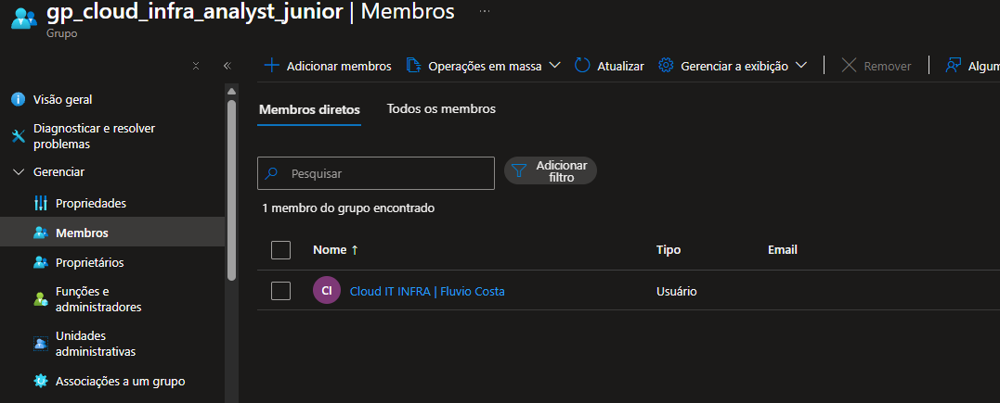

    * Pleno : 

        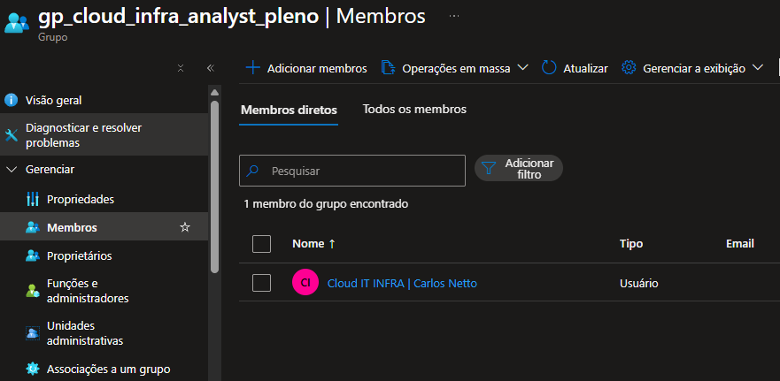

    * Senior : 

        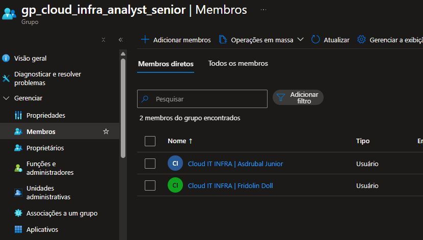

    * Gerente : 

        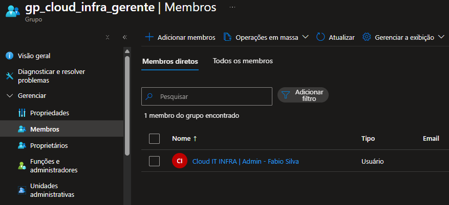

    * Todos :

        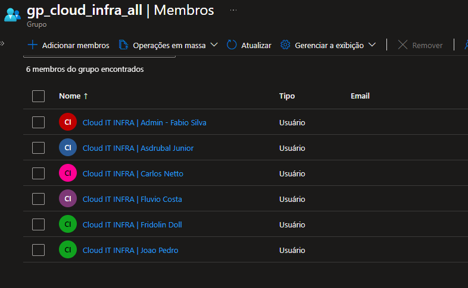

* **Equipe Suporte Tecnico**.

    * Junior :

        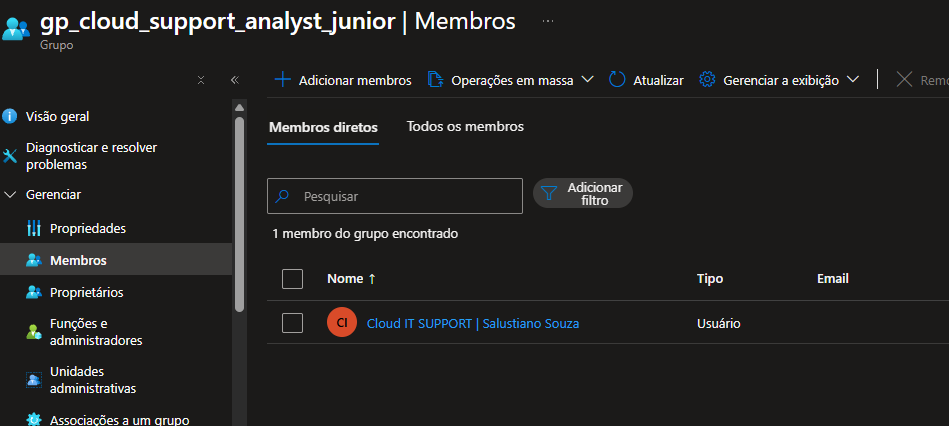

    * Pleno : 

        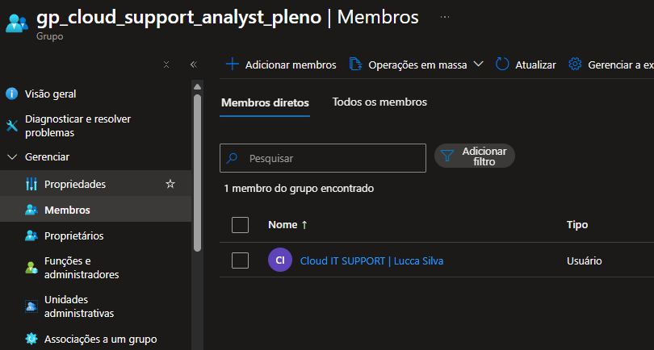

    * Senior : 

        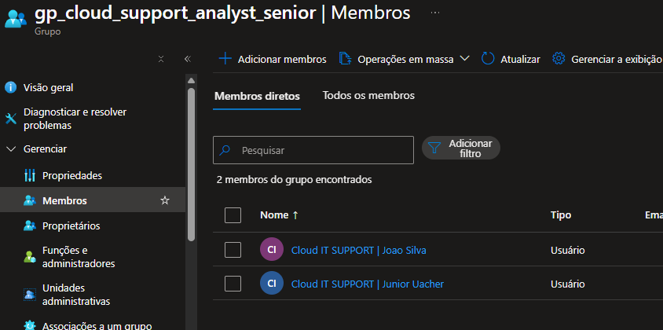

    * Gerente : 

        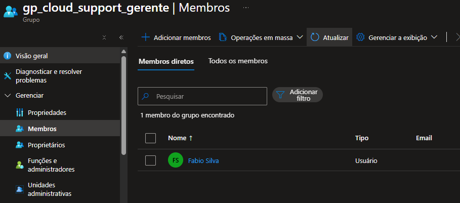

    * Todos :

        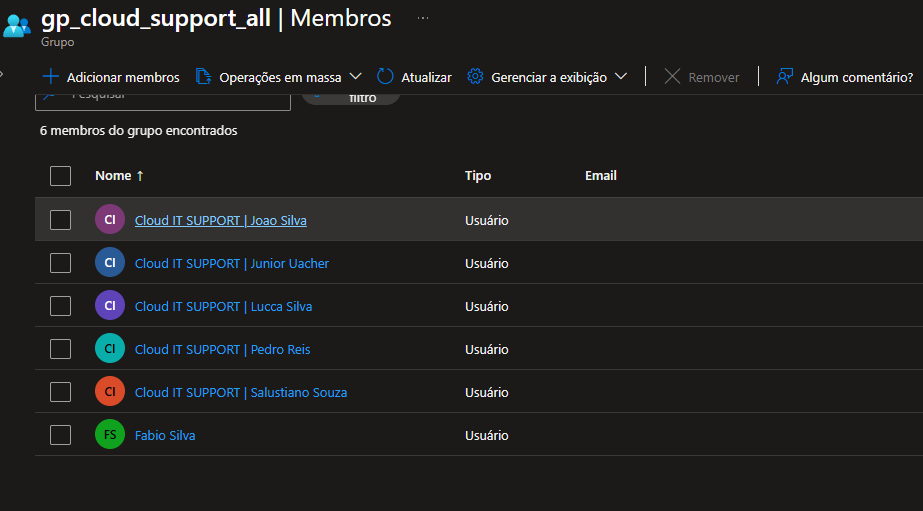

* **Todos colaboradores Junior**:

    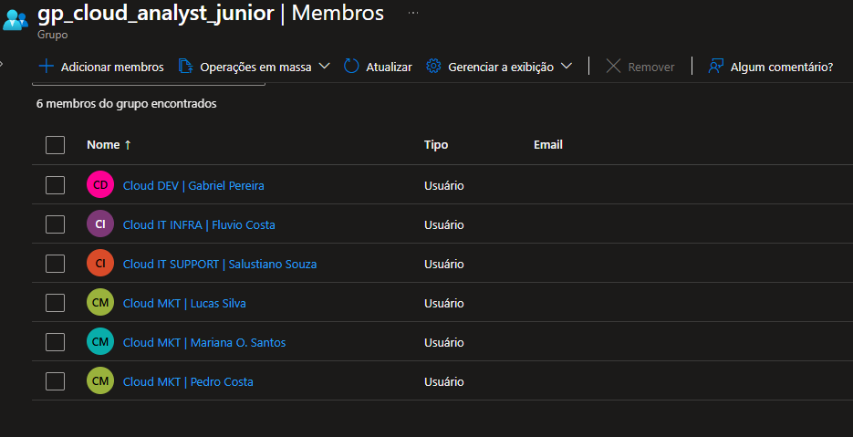

* **Todos colaboradores Analistas Pleno**:

    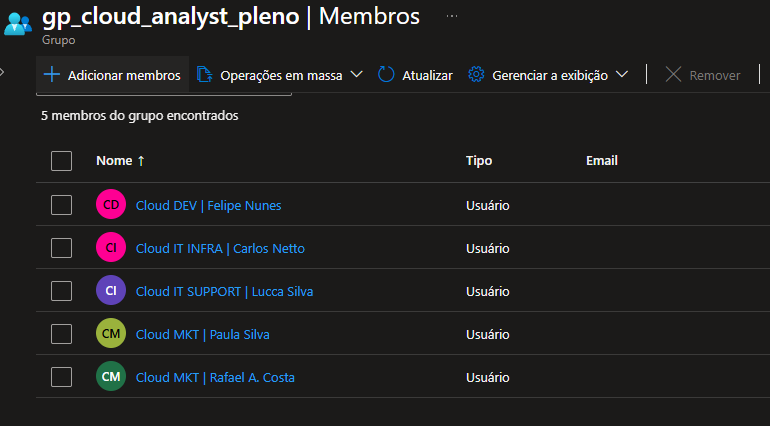

* **Todos colaboradores Analistas Senior**:

    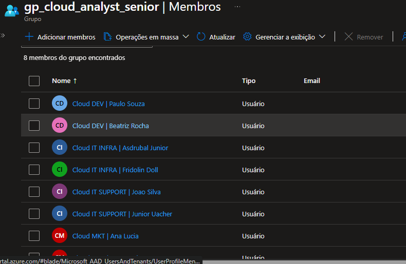

* **Todos colaboradores Gerentes**:

    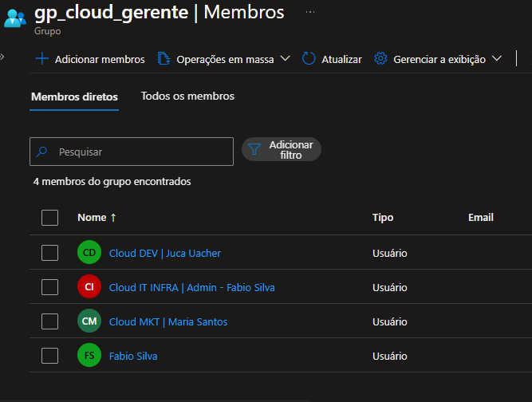    

# 4. 💻 Comandos | Scripts Utilizados

* **Equipe MKT**.

    * Junior : (user.department -eq "Marketing") and (user.jobTitle -eq "Analista MKT Junior").

    * Pleno : (user.department -eq "Marketing") and (user.jobTitle -eq "Analista MKT pleno").

    * Senior : (user.department -eq "Marketing") and (user.jobTitle -eq "Analista MKT Senior").

    * Gerente : (user.department -eq "Marketing") and (user.jobTitle -contains "gerente")

    * Todos : (user.department -eq "Marketing")

* **Equipe Dev**.

    * Junior : (user.department -eq "Development") and (user.jobTitle -eq "Analista Dev Junior").

    * Pleno : (user.department -eq "Development") and (user.jobTitle -eq "Analista Dev pleno").

    * Senior : (user.department -eq "Development") and (user.jobTitle -eq "Analista Dev Senior").

    * Gerente : (user.department -eq "Development") and (user.jobTitle -contains "gerente").

    * Todos : (user.department -eq "Development")

* **Equipe Infra**.

    * Junior : (user.department -eq "IT Infraestructure") and (user.jobTitle -eq "Analista IT Infra Cloud Junior").

    * Pleno : (user.department -eq "IT Infraestructure") and (user.jobTitle -eq "Analista IT Infra Cloud Pleno").

    * Senior : (user.department -eq "IT Infraestructure") and (user.jobTitle -eq "Analista IT Infra Cloud Senior").

    * Gerente : (user.department -eq "IT Infraestructure") and (user.jobTitle -contains "gerente")

    * Todos : (user.department -eq "IT Infraestructure")

* **Equipe Suporte tecnico**.

    * Junior : (user.department -eq "IT Support") and (user.jobTitle -eq "Analista IT Support junior").

    * Pleno : (user.department -eq "IT Support") and (user.jobTitle -eq "Analista IT Support Pleno").

    * Senior : (user.department -eq "IT Support") and (user.jobTitle -eq "Analista IT Support Senior").

    * Gerente : (user.department -eq "IT Support") and (user.jobTitle -contains "gerente").

    * Todos : (user.department -eq "IT Support")

* **Todos os colaboradores**.

    * Junior : (user.jobTitle -contains "junior").

    * Pleno : (user.jobTitle -contains "pleno").

    * Senior : (user.jobTitle -contains "senior").

    * Gerente : (user.jobTitle -contains "gerente").
   
# 4.🏁 Encerramento

* **Motivo do encerramento**:

    * Todos os grupos foram criados com sucesso.

    * Solicitação atendida e validada com sucesso.

    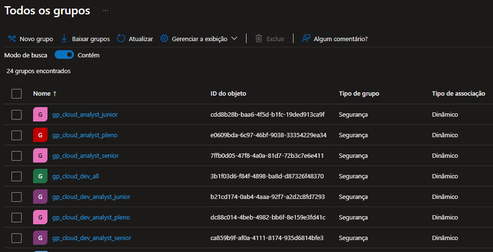

**Próxima ação**: *Nenhuma ação pendente*.

* Status: ☐ Em análise | ☐ Em implementação | ☐ Aguardando validação | ☑ Concluído

* Analista responsável: Fabio Silva

#