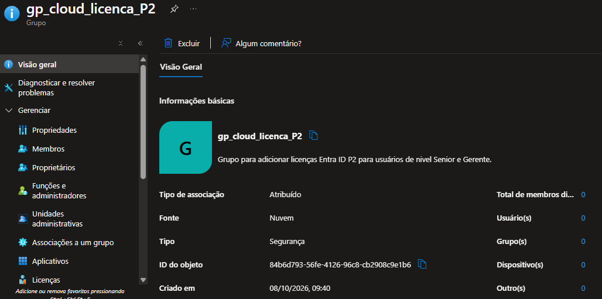
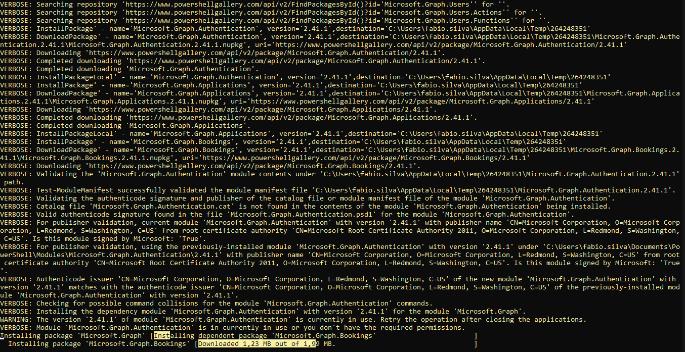
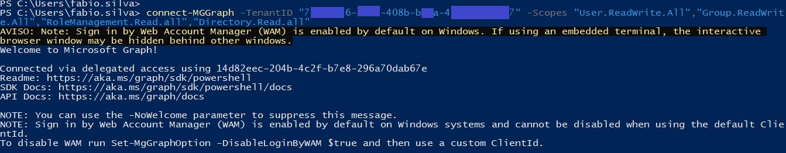
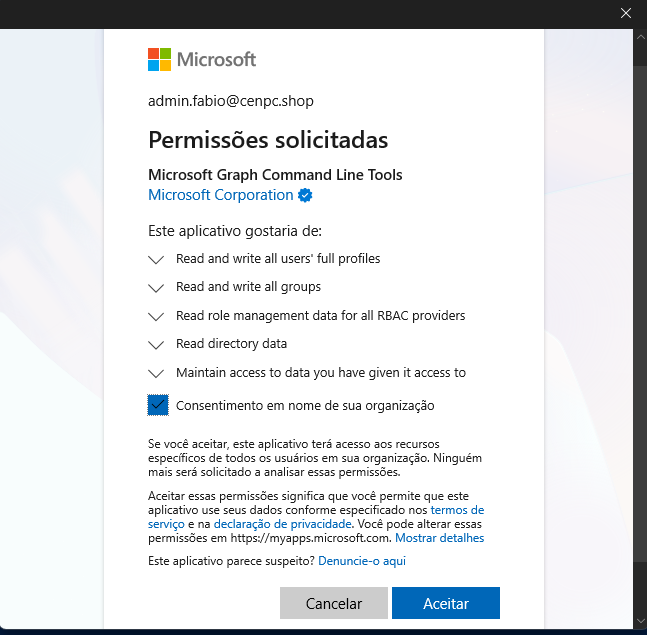
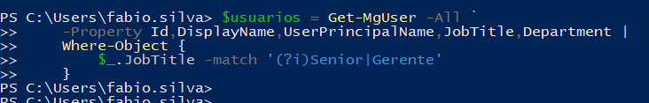
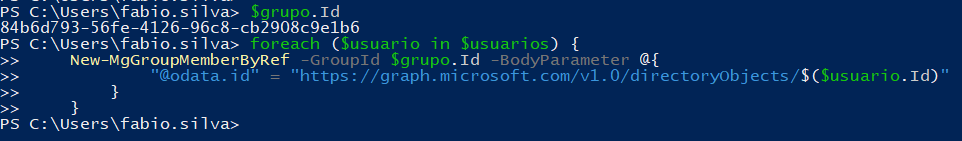
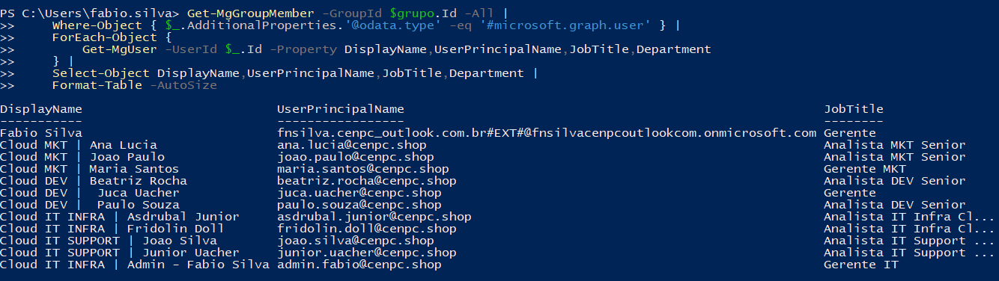
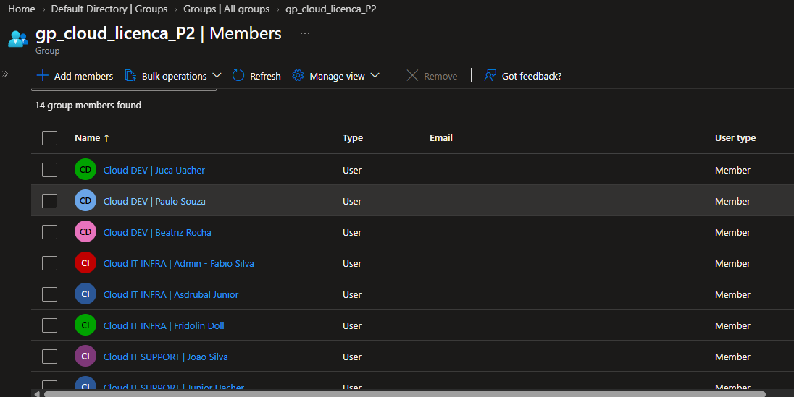
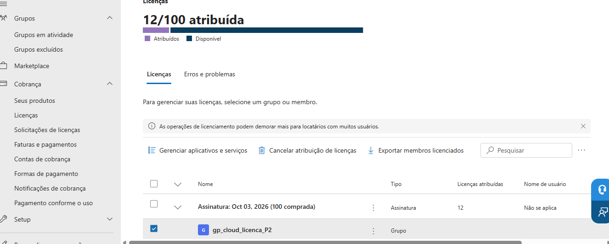
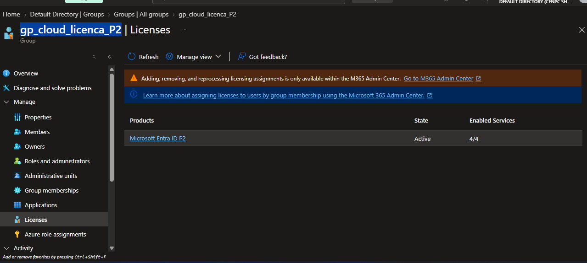

# 🎫 CHAMADO DE ASSOCIANDO LICENÇAS P2

* Número do chamado: REQ-2026-1005-001
* Categoria: TI | Licenças | Entra ID
* Prioridade: Média
* Solicitante: TI
* Equipe responsável: Suporte Técnico
* Status: ☑ Em análise | ☐ Em implementação | ☐ Aguardando validação | ☐ Concluído.

# 1. 📌 Descrição.

* Solicito a atribuição de licenças Microsoft Entra ID Premium P2 aos usuários que possuam nível hierárquico Gerente ou Senior, conforme os respectivos atributos cadastrados no Microsoft Entra ID.

A identificação dos usuários deverá considerar os campos de cargo/nível definidos no diretório, contemplando especificamente os níveis:

    * Gerente
    * Senior

Após a identificação, realizar a associação da licença Microsoft Entra ID Premium P2 aos respectivos usuários, garantindo que a atribuição seja realizada de forma adequada e sem impactar as licenças ou configurações existentes.

# 2. 📝 Atendimento | 📸 Evidências.

> Para esse chamado os grupos solicitados foram criados usando associação estática (Assigned User).

1)  Acessando Entra ID *Com uma conta nativa do Tenant* > Gerenciar > Grupos > Novo Grupo.

    * **Nome do Grupo** : gp_cloud_licenca_P2

    * **Tipo de associação** : Assigned | Atribuido.

2) Autenticando no Entra ID usando o Azure Powershell.

    * Executando Powershell versão 7.

    * Iniciando novamente o serviço do Powershell.

    * Após a autenticação, foi realizada uma consulta para verificar os usuários cadastrados no Tenant.

    * Foi criada uma variavel "$Usuarios" para armazenar a consulta dos usuários que foram cadastrados.

    * Criando uma variavel "$grupo" para armazenar a consulta do grupo.

    * Consultando as informações do grupo.
    
    * Capturando o ID do grupo que foi criado.

    * Adicionando os usuários no grupo "gp_cloud_licenca_P2".

    * Consultando os usuários se foram incluidos no grupo.

3) Atribuindo as licenças P2 ao grupo "gp_cloud_licenca_P2".

    * No portal *https://admin.cloud.microsoft/* > Cobranças > Licenças > *Localize a licença EntraID P2* > Atribuir Licenças.

    * Em *Procurar um nome ou endereço de e-mail* foi selecionado o grupo *gp_cloud_licenca_P2*.

    * Após o procedimento, as licenças Entra ID P2 foram atribuidas aos usuários do grupo.  

# 3. 💻 Comandos / Scripts Utilizados

> Registrar somente os comandos relevantes para reprodução do procedimento.

```powershell

# Instalando o modulo "Microsoft Graph PowerShell" no Powershell Pc local.
    Install-Module Microsoft.Graph -Scope CurrentUser

# Atualizando a versão do Microsoft Graph.
    Update-Module Microsoft.Graph -Force -verbose

# Carregando apenas a autenticação do MS Graph
    Import-Module Microsoft.Graph.Authentication -Verbose

# Reiniciando o serviço do Powershell.
    Start-Process powershell

# Comando para conectar no Entra ID.
    connect-MGGraph -TenantID "700000006-dXXX-4X0b-bxxx-4x0000xx0000" -Scopes "User.ReadWrite.All","Group.ReadWrite.All","RoleManagement.Read.all","Directory.Read.all"

# Comando para consultar os usuários cadastrados no Tenant.
    get-mgUser

# Criando uma consulta para capturar usuários com JobTitle = Senior ou Gerente e colocando na variavel $usuarios.
    $usuarios = Get-MgUser -All -Property Id,DisplayName,UserPrincipalName,JobTitle,Department | Where-Object {
        $_.JobTitle -match '(?i)Senior|Gerente'
    }
    
    $usuarios | Select-Object DisplayName,UserPrincipalName,JobTitle,Department

# Consultando o grupo que foi criado.    
    $usuarios | Format-Table DisplayName,UserPrincipalName,JobTitle,Department

# Capturando ID do grupo colocando na variavel.
    $grupo.Id

# Adicionando os usuários no grupo que foi criado.
    foreach ($usuario in $usuarios) {
    New-MgGroupMemberByRef -GroupId $grupo.Id -BodyParameter @{
            "@odata.id" = "https://graph.microsoft.com/v1.0/directoryObjects/$($usuario.Id)"
        }
    }

# Consultando os usuários que foram inclidos no grupo "gp_cloud_licenca_P2".
    Get-MgGroupMember -GroupId $grupo.Id -All |
    Where-Object { $_.AdditionalProperties.'@odata.type' -eq '#microsoft.graph.user' } |
    ForEach-Object {
        Get-MgUser -UserId $_.Id -Property DisplayName,UserPrincipalName,JobTitle,Department
    } | Select-Object DisplayName,UserPrincipalName,JobTitle,Department | Format-Table -AutoSize

```
**Por causa do erro:** *Connect-MgGraph: Could not load file or assembly 'System.Text.Json, Version=10.0.0.0, Culture=neutral, PublicKeyToken=cc7b13ffcd2ddd51'. O sistema não pode encontrar o arquivo especificado.* 

Foi necessário atualizar o modulo do MS Graph usando o comando *Update-Module Microsoft.Graph -Force*

# 4.📸 Evidências

* Criando grupo "gp_cloud_licenca_P2"

    

* Instalando o modulo "Microsoft Graph PowerShell" no Powershell Pc local.
    
    

* *# Comando para conectar no Entra ID.*

    

    Permissões para realizar a autenticação.
    
    

* *# Criando uma consulta para capturar usuários com JobTitle = Senior ou Gerente e colocando na variavel $usuarios.*

    

* *# Adicionando os usuários no grupo que foi criado.*

    

* *# Consultando os usuários que foram inclidos no grupo "gp_cloud_licenca_P2".*

    

* Analizando o import dos usuários pelo portal Azure.

    

* Licenças atribuidas aos usuários do grupo *Pelo porta Admin Center*.

    

* Visualização pelo portal Azure.    

    

# 5.🏁 Encerramento

* **Motivo do encerramento:**

    * O grupo solicitado foi criado.
    * As licenças *Entra ID P2* foram atribuidas aos usuários com sucesso. 

**Solicitação atendida e validada com sucesso.

* **Próxima ação:**

    * Nenhuma ação pendente.


* Status: ☐ Em análise | ☐ Em implementação | ☐ Aguardando validação | ☑ Concluído

* Analista responsável: Fabio Silva

#
