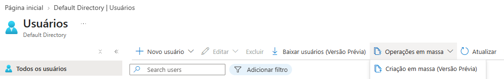
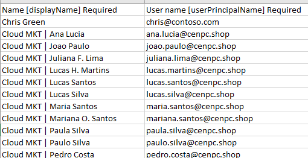
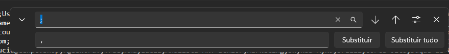
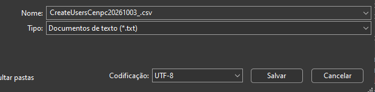
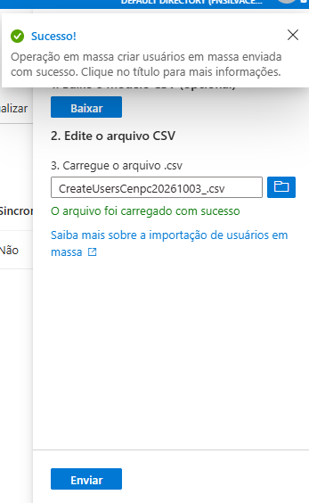

# CHAMADO DE ACESSO — Entra ID

* Número do chamado: REQ-2026-1003-001
* Categoria: RH | Acessos | Entra id
* Prioridade: Média
* Solicitante: RH
* Equipe responsável: Suporte Técnico
* Status: ☑ Em análise | ☐ Em implementação | ☐ Aguardando validação | ☐ Concluído

# 1. Descrição.

* A equipe do RH solicitou que fossem cadastrados novos colaboradores para CENPC.

# Colaboradores

| Nome        | Sobrenome | Cargo                          | Departamento       |
| ----------- | --------- | ------------------------------ | ------------------ |
| Ana         | Lucia     | Analista MKT Senior            | Marketing          |
| Joao        | Paulo     | Analista MKT Senior            | Marketing          |
| Juliana     | Lima      | Coordenadora MKT               | Marketing          |
| Lucas       | Martins   | Analista MKT Mídias Digitais   | Marketing          |
| Lucas       | Santos    | Assistente MKT                 | Marketing          |
| Lucas       | Silva     | Analista MKT Junior            | Marketing          |
| Maria       | Santos    | Gerente MKT                    | Marketing          |
| Mariana     | Santos    | Analista MKT Junior            | Marketing          |
| Paula       | Silva     | Analista MKT Pleno             | Marketing          |
| Paulo       | Silva     | Assistente MKT                 | Marketing          |
| Pedro       | Costa     | Analista MKT Junior            | Marketing          |
| Rafael      | Costa     | Analista MKT Pleno             | Marketing          |
| Beatriz     | Rocha     | Analista DEV Senior            | Development        |
| Felipe      | Nunes     | Analista DEV Pleno             | Development        |
| Gabriel     | Pereira   | Analista DEV Junior            | Development        |
| Juca        | Uacher    | Analista DEV Senior            | Development        |
| Paulo       | Souza     | Analista DEV Senior            | Development        |
| Thiago      | Barbosa   | Tech DEV Lead                  | Development        |
| Asdrubal    | Junior    | Analista IT Infra Cloud Senior | IT Infraestructure |
| Carlos      | Netto     | Analista IT Infra Cloud Pleno  | IT Infraestructure |
| Fabio Silva | Admin     | Gerente IT Infra Cloud         | IT Infraestructure |
| Fridolin    | Doll      | Analista IT Infra Cloud Senior | IT Infraestructure |
| Fluvio      | Costa     | Analista IT Infra Cloud Junior | IT Infraestructure |
| Joao        | Pedro     | Assistente IT Infra Cloud      | IT Infraestructure |
| Joao        | Silva     | Analista IT Support Senior     | IT Support         |
| Junior      | Uacher    | Analista IT Support Senior     | IT Support         |
| Lucca       | Silva     | Analista IT Support Pleno      | IT Support         |
| Pedro       | Reis      | Assistente IT Support          | IT Support         |
| Salustiano  | Souza     | Analista IT Support Junior     | IT Support         |

# 2. Atendimento.

### *Para esse atendimento, será utilizada a opção de cadastro em massa dos usuários.*

* **EntraID > Gerenciar > Usuários > *Operações em Massa* > Criação em Massa**

    .

* Foi realizado o download do arquivo *.csv*.

* Foi realizada a edição do arquivo, inserindo os usuários que foram informados pelo RH.

    .

    ` Ao abrir o arquivo no *notepad* foi realizada a substituição do sinal ";" para "," `.

    .

    ` Ao salvar o arquivo "caso o idioma do portal esteja em português", altere a opção *codoficação* de *ANSI* para *UTF-8* `

    .

* Foi realizado o Upload do arquivo com sucesso.

    .

* Foi realizado o refresh na página do portal, e foi verificado que todos os usuários foram cadastrados com sucesso.
   
# 3. Encerramento

* Os usuários foram cadastrados com sucessos.

    .

* O chamado foi encerrado com sucesso.

* Status: ☐ Em análise | ☐ Em implementação | ☐ Aguardando validação | ☑ Concluído

* Analista responsável: Fabio Silva

#