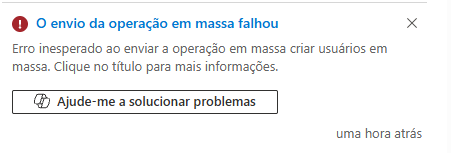
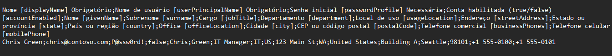
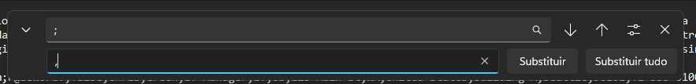
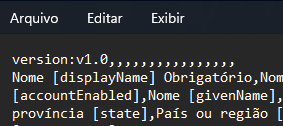
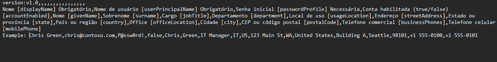
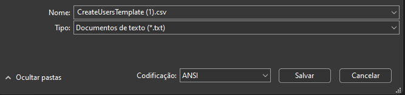
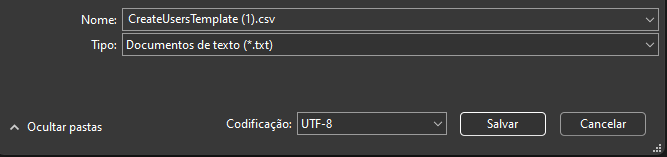
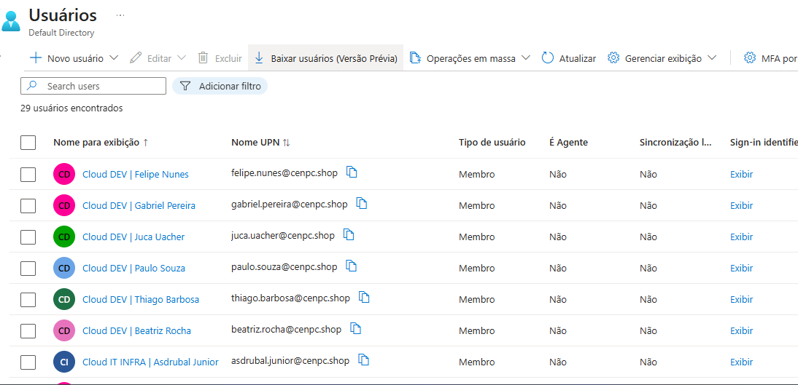

# 🎫 Entra ID - Bulk User: "O envio da operação em massa falhou".

Após realizar o ulpload do arquivo *.CSV* para o Entra ID e enviar o arquivo para processamento de **Bulk User** | *Criação de usuários em massa*, o portal retorna o **falha** conforme a imagem no exemplo abaixo.

.

## 🛠️ Procedimentos Executados 🛠️

1. Abra o arquivo *.CSV* que foi criado.

    .

2. Substitua o sinal de pontuação "**;**" pela "**,**".

    .

3. Inclua a seguinte linha de texto:

    *version:v1.0,,,,,,,,,,,,,,,,*

    .

    e em seguida antes do nome "*Chiris Green*" coloque a palavra *Exemplo*.

    .

4. Caso o *TENANT Entra ID* esteja com o idioma em *Português* no momento que for salvar o arquivo, altere em **Codificação** de *ANSI* ...

    .

    ... para *UTF-8*.

    .

5. Realize o procedimento de Upload e processamento do arquivo novamente.

    .

## ✅ Resultado

Os usuários foram cadastrados com sucesso.

   .