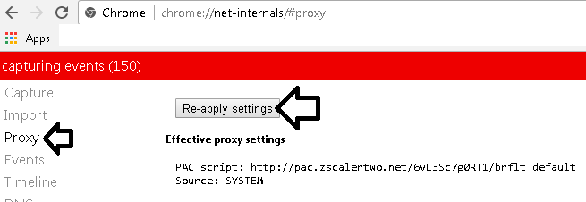
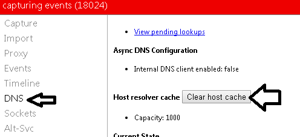

# CHAMADO DE ACESSO — SITE

* Número do chamado: INC-2026-0929-002
* Categoria: Financeiro / Navegadores / Chrome
* Prioridade: Média
* Solicitante: Financeiro
* Equipe responsável: Suporte Técnico
* Status: 
       * ☑ Em análise 
       * ☐ Em implementação 
       * ☐ Aguardando validação 
       * ☐ Concluído

# 1. Descrição.

* Usuário informa que ao tentar acessar qualquer site a página fica carregando e não abre.

# 2. Atendimento.

* No navegador foi colocado o endereço de configuração do proxy chrome://net-internals/#proxy.

* Na opção "proxy" clique no botão "Re-Apply settings".

    

* Em "DNS" > "Clear host cache".

    

* Abra as configurações do Chrome > avançados.

    * Limpe os cookies.
    * Limpe os arquivos temporários.

* Reinicie o navegador.

* Consulte a página https://fortiguard.com e verificar a categoria do site.
    
# 3. Encerramento

* Após os procedimentos a situação foi normalizada.

* Status: 
       * ☐ Em análise 
       * ☐ Em implementação 
       * ☐ Aguardando validação 
       * ☑ Concluído

* Analista responsável: Fabio Silva

#
