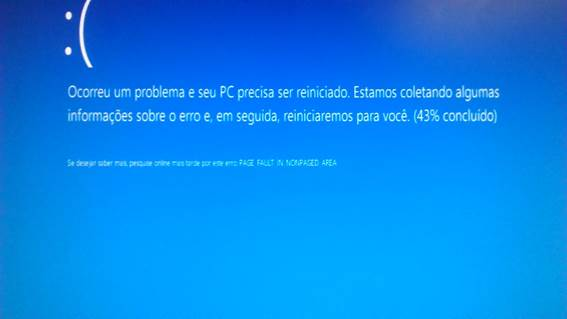
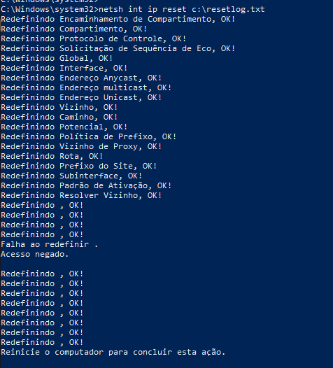

# CHAMADO DE ACESSO — SITE

* Número do chamado: INC-2026-1001-001
* Categoria: Windows | S.O
* Prioridade: Média
* Solicitante: Administrativo | Administração
* Equipe responsável: Suporte Técnico
* Status: ☑ Em análise | ☐ Em implementação | ☐ Aguardando validação | ☐ Concluído

# 1. Descrição.

* O usuário informa que ao conectar o cabo de rede no notebook, o equipamento exibe "tela azul" e reinicia.

     

# 2. Atendimento.

* Foi utilizado o prompt de comando (cmd) *administrador local*.

* Executado o comando *netsh int ip reset c:\resetlog.txt* para realizar o reset na placa de rede do equipamento.

     

* O equipamento foi reiniciado.

* Após reiniciado, foi conectado o cabo de rede no equipamento, nenhuma anormalidade foi encontrada.
    
# 3. Encerramento

* O equipamento não apresentou mais "tela azul" ao conectar o cabo de rede.

* Status: ☐ Em análise | ☐ Em implementação | ☐ Aguardando validação | ☑ Concluído

* Analista responsável: Fabio Silva

#
