# CHAMADO DE ACESSO — SITE

* Número do chamado: INC-2026-1002-001
* Categoria: Comercial / Windows / Autenticação
* Prioridade: Média
* Solicitante: Comercial
* Equipe responsável: Suporte Técnico
* Status: 
      * ☑ Em análise
      * ☐ Em implementação 
      * ☐ Aguardando validação 
      * ☐ Concluído

# 1. Descrição.

* Após tirar o computador do dominio, o Windows não permite que seja realizada a autenticação com outra conta de dominio.

* O computador estava no dominio, porém não estava sincromizando com o domain controler, com isso ocorreu a necessidade de retira-lá do dominio.

    * Equipamento no dominio.

        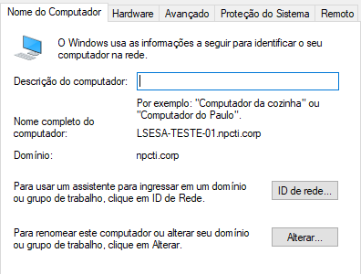

    * Após retira-lá do dominio e reinicia-la, o sistema operacional reconhece somente o ultimo usuário que estava autenticado, não deixando que outra conta seja colocada, mesmo que a conta local *administrador* esteja habilitada.

        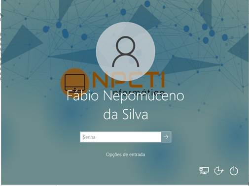

# 2. Atendimento.

* Foi realizado o download da ferramenta "*Microsoft Diag Recovery Tool Kit* - https://www.microsoft.com/en-us/download/100607".

* Foi criada uma ISO bootável da ferramenta.

* Em seguida, o computador foi reiniciado.

    *  Na tela do Windows PE, escolha a opção TROUBLESHOOT para exibir mais informações.

        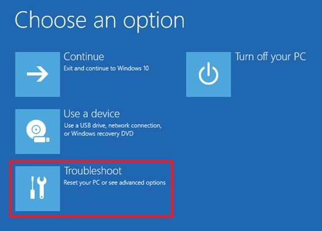

    * Em Troubleshoot escolha a opção *Microsoft Diagnostics and Recovery Toolset*.

        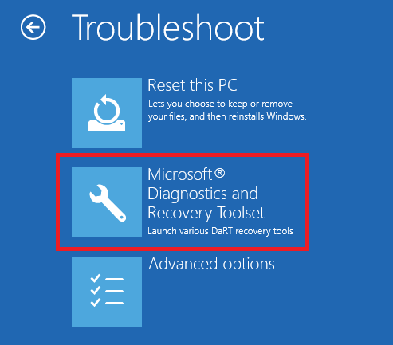

    * Em Recovery Tool, selecione a opção Windows 10 para continuar.

        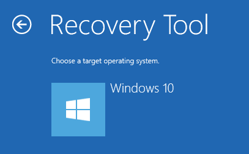

    *  Na tela do programa DIAGNOSTICS AND RECOVERY TOOLSET realize os procedimentos:

        a. Em LOCK SMITH realize o reset da senha da perfil *ADMINISTRADOR local*.

        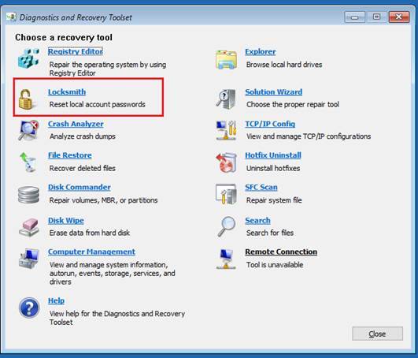

        b. Selecione a conta ADMINISTRADOR e informe uma nova senha.
        
        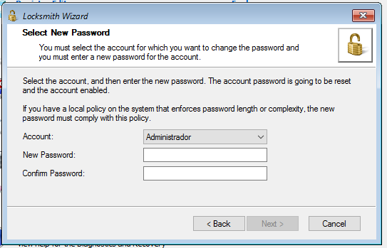
        
        c.  Para concluir clique em FINISH.

        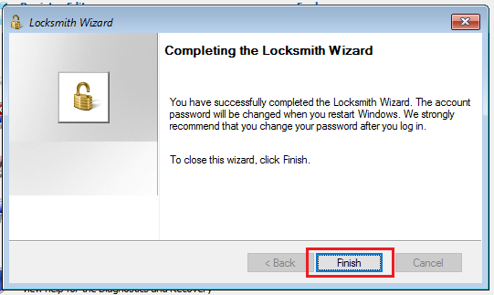

        d. Em seguida, clique em REGISTRY EDITOR.

        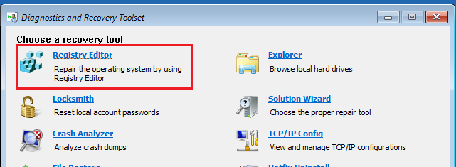

        * Localize a chave de registro “DontDisplayLastUserName” navegando “HKEY_LOCAL_MACHINES>Software>Microsoft>Windows>CurrentVersion>Policies>System”

            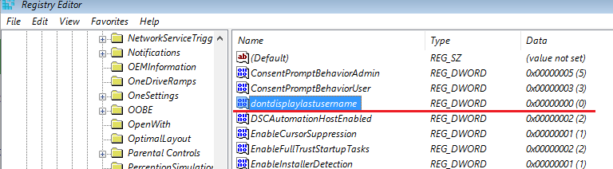

        * *Por padrão o valor do dado é “zero”*.

            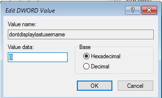

        * Altere para “UM” e clique em OK para salvar.

            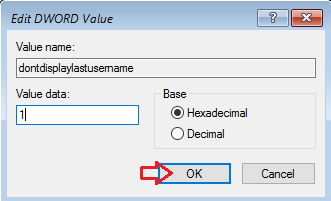

        e. Clique em CLOSE para fechar a ferramenta.

        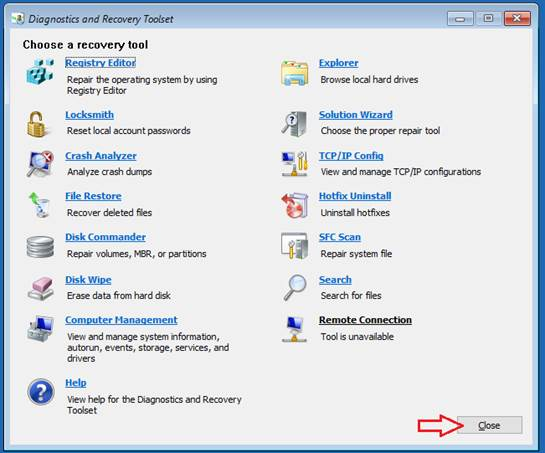
    
    * Retire o pendrive / mídia de boot e clique em CONTINUE para iniciar o sistema operacional.

        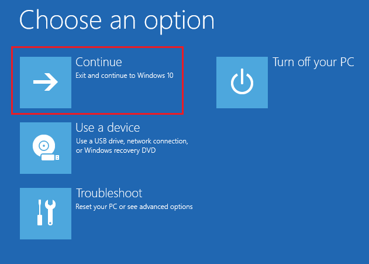

* Após o procedimento o sistema operacional ira iniciar e exibir a opção para informar a conta que deseja autenticar.

    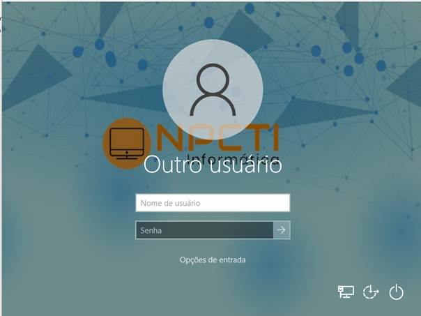

    Está autenticação será realizada com o perfil ADMINISTRADOR local.
    
    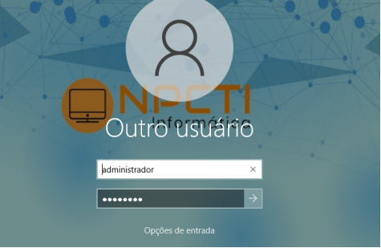

* Em seguida o sistema operacional solicitou que fosse alterada a senha no primeiro logon.

    

* Foi informada uma nova senha.

    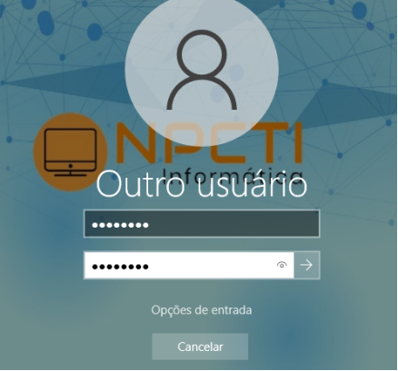

* Após alterar a senha clique em OK para autenticar no Windows 10.

    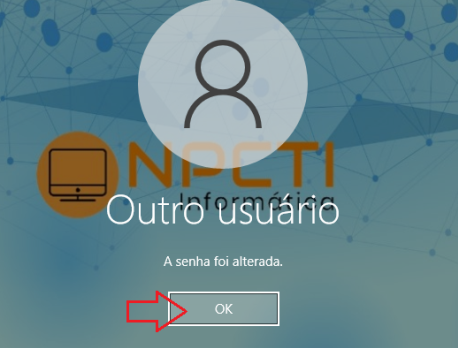

* Após os procedimentos a autenticação no Windows 10 foi realizada com sucesso.

    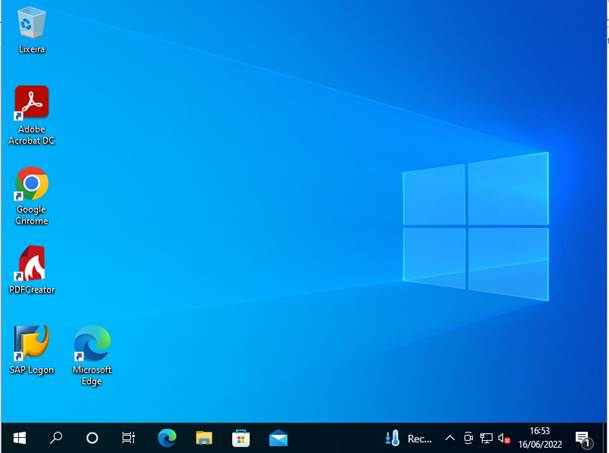

    
# 3. Encerramento

* Por questões de boas práticas, após autenticar com o perfil ADMINISTRADOR altere a senha novamente no GERENCIAMENTO DO COMPUTADOR.

    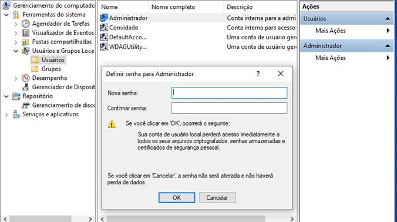

* A situação foi normalizada.

* Status: 
       * ☐ Em análise 
       * ☐ Em implementação 
       * ☐ Aguardando validação 
       * ☑ Concluído

* Analista responsável: Fabio Silva

#
