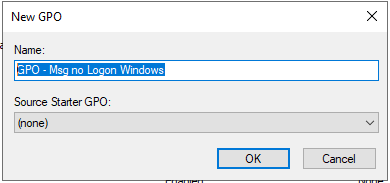
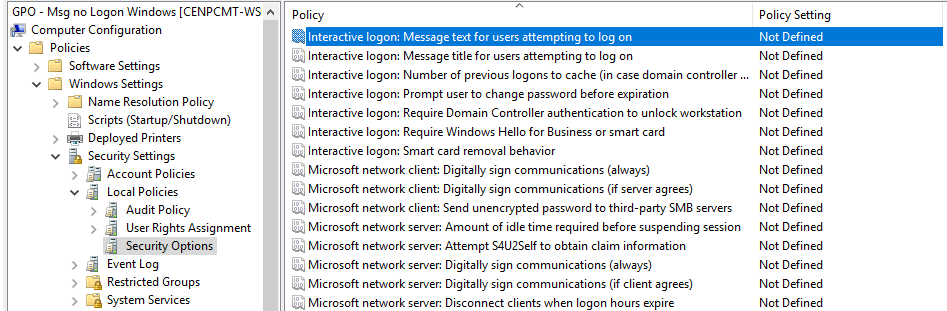
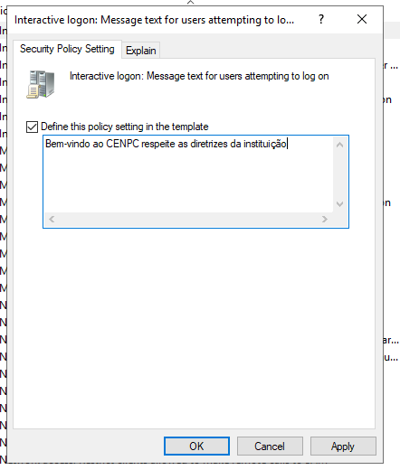
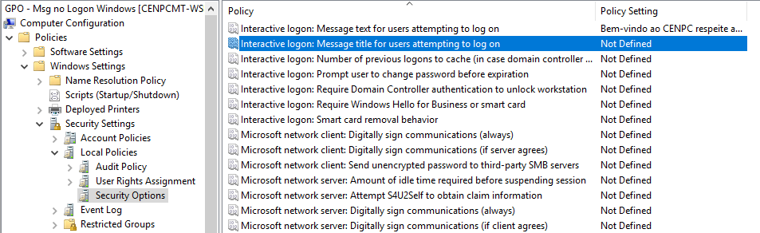
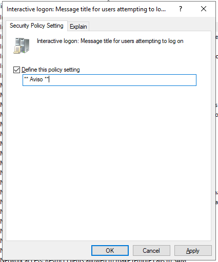
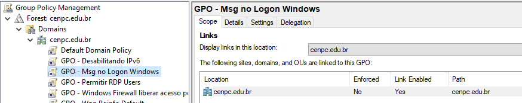
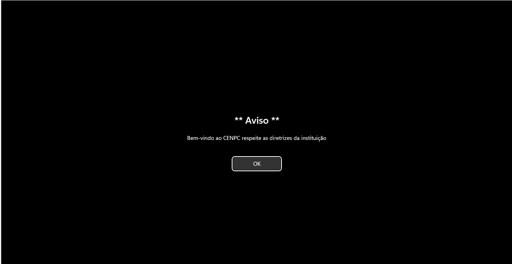

# [SOLICITAÇÃO] Mensagem de Boas-vindas no Logon do Windows

* Número do chamado: REQ-2026-0927-001
* Categoria: Infraestrutura / Active Directory
* Subcategoria: Group Policy (GPO)
* Classificação: Administração de GPO / Política de Logon
* Prioridade: Média
* Solicitante: RH
* Tipo: Solicitação de Serviço / Configuração
* Equipe responsável: Infrastructure
* Status: Atendimento / Concluido

## 🔎 Análise / Diagnóstico

* Neste momento, os usuários não recebem nenhuma notificação após o logon no computador.

    

## 📝 Descrição do atendimento.

1) Executada a ferramenta server "Group policy Management" no server manager.

2) Em group policy Object foi criada a politica *GPO - Msg no Logon Windows*.

    

3) Editando a GPO que foi criada.

    * Computer Configuration > Policies > Windows Settings > Security Settings > Local Policies > Security Options > *Interactive logon - Message tex for users attempting to lon on*.

        

    * Diretiva habilitada e mensagem incluida.

        

    * Computer Configuration > Policies > Windows Settings > Security Settings > Local Policies > Security Options > *Interactive logon - Message title for users attempting to lon on*.

        

    * Diretiva habilitada e mensagem incluida.

        

4) GPO foi incluida na raiz do dominio.

    

5) No computador cliente foi executado o comando abaixo.

    *gpupdate/force*

6) Realizado o logoff/logon no computador cliente.

7) Após o logon a mensagem foi exibida com sucesso.

    

## 🏁 Encerramento

**Status:** ✅ Resolvido

**Motivo do encerramento:** Solicitação atendida e validada com sucesso.

**Próxima ação:** Nenhuma ação pendente.
